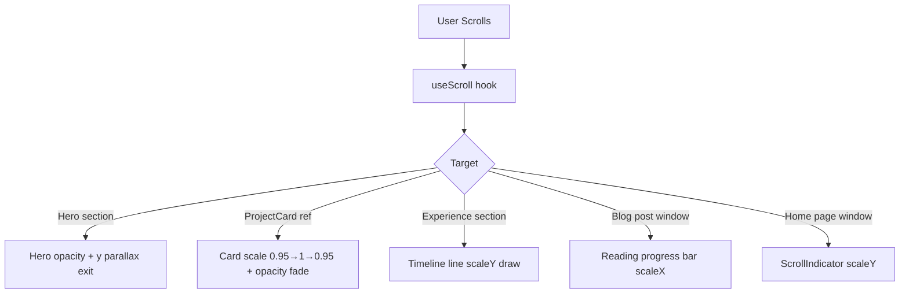

# Design.md — Visual System & Interaction Design

## Executive Summary

This document is a deep-dive visual and interaction design audit of a personal portfolio and blog website built with Next.js App Router. The site belongs to Kartik Jindal, a Full Stack Architect, and is designed to communicate technical mastery through an immersive, cinematic dark-mode aesthetic.

The design language is best described as **cinematic dark luxury** — a near-black background, a single emerald-green primary accent, Playfair Display serif headlines mixed with PT Sans body text, aggressive letter-spacing, and a layered depth system built from glassmorphism, grain texture, and a persistent Three.js 3D background. Every public-facing page is animated. Motion is not decorative — it is structural to the brand identity.

The site is technically ambitious: a custom WebGL star-field and orbital ring system runs as a fixed global background across all pages, a custom cursor replaces the OS pointer on desktop, an 8-second cinematic intro screen plays on first load, and scroll-driven animations govern nearly every section reveal. The contact form opens as a styled Dialog modal with a sci-fi terminal aesthetic. Project detail pages use Next.js parallel routes to render as intercepting modals when navigated from the work list, falling back to full pages on direct URL access.

**Strengths:** Exceptionally strong visual identity, cohesive dark luxury language, sophisticated motion choreography, well-structured component hierarchy, good responsive fallbacks.

**Weaknesses:** 8-second intro blocks content access, Three.js background has no reduced-motion fallback, custom cursor breaks accessibility, several font sizes use viewport units that can become extreme on large screens, the blog post sidebar subscribe button is non-functional, and the design system has minor inconsistencies between shadcn base variants and the heavily overridden portfolio components.

---

## 1. Design System Overview

### 1.1 Color Palette

All colors are defined as CSS custom properties in `src/app/globals.css` using HSL values and consumed via Tailwind's `hsl(var(--token))` pattern.

| Token | HSL Value | Hex Approx | Usage |
|---|---|---|---|
| `--background` | `240 10% 2%` | `#050508` | Page background, near-black with blue tint |
| `--foreground` | `0 0% 98%` | `#FAFAFA` | Primary text |
| `--card` | `240 10% 4%` | `#090910` | Card surfaces |
| `--primary` | `161 94% 45%` | `#06D68A` | Emerald green — accent, CTAs, highlights |
| `--accent` | `161 72% 70%` | `#7EEDC4` | Lighter green — testimonial quotes, badges |
| `--muted-foreground` | `240 5% 60%` | `#919199` | Secondary text, descriptions |
| `--border` | `240 4% 12%` | `#1C1C21` | Subtle borders |
| `--destructive` | `0 62.8% 30.6%` | `#7A1515` | Error states |
| `--ring` | `161 94% 45%` | Same as primary | Focus rings |

**Opacity-based layering** is used extensively throughout the codebase rather than separate color tokens:
- `text-white/50` — nav items at rest
- `text-white/60` — hero description
- `text-white/80` — blog post body
- `bg-primary/5` — subtle tinted surfaces
- `border-white/5` — near-invisible borders
- `bg-white/[0.02]` — glass card backgrounds

This creates a sophisticated depth hierarchy without needing many distinct color values.

### 1.2 Typography

Defined in `tailwind.config.ts` under `fontFamily`:

| Role | Font | Weights Used | Application |
|---|---|---|---|
| `font-headline` | Playfair Display (serif) | 400–900, italic variants | All H1–H6, section titles, hero name, footer brand |
| `font-body` | PT Sans (sans-serif) | 400, 700, italic | Body copy, nav items, descriptions, form labels |
| `font-code` | monospace (system) | — | Not visibly used in public UI |

Both fonts are loaded from Google Fonts via `<link>` tags in `src/app/layout.tsx` with `preconnect` hints. There is no `font-display: swap` specified — this is a potential LCP risk.

**Typography Scale in Practice:**

| Context | Class | Computed Size |
|---|---|---|
| Hero name | `text-[12vw]` | ~192px at 1600px viewport |
| About headline | `text-8xl` | 96px |
| Contact headline | `text-[10rem]` | 160px |
| Work page H1 | `text-[10rem]` | 160px |
| Section H2 | `text-7xl–text-8xl` | 72–96px |
| Project title (card) | `text-7xl` | 72px |
| Blog post H1 | `text-6xl` | 60px |
| Body large | `text-2xl–text-4xl` | 24–36px |
| Body regular | `text-lg–text-xl` | 18–20px |
| Labels/badges | `text-[10px]–text-xs` | 10–12px |
| Micro labels | `text-[9px]` | 9px |

**Letter-spacing** is a defining characteristic of this design. Labels and nav items use `tracking-[0.4em]` to `tracking-[0.6em]` — extremely wide spacing that creates a luxury editorial feel. Headlines use `tracking-tighter` for contrast.

**Font weight** is used as a contrast tool: `font-black` (900) for labels and nav items, `font-light` (300) for body descriptions, `font-bold` (700) for headlines.

### 1.3 Spacing Rhythm

Sections use large vertical padding to create breathing room:

| Context | Padding |
|---|---|
| Hero | `py-12 md:py-24` |
| About | `py-24 md:py-48` |
| Projects | `py-24 md:py-48` |
| Experience | `py-24 md:py-32` |
| Testimonials | `py-32` |
| Contact | `pt-24 pb-24 md:pt-64` |
| Footer | `py-24` |

The rhythm is intentionally generous — sections breathe at 96–192px vertical gaps on desktop. This is consistent with the luxury editorial aesthetic but means the page is very long.

Internal component spacing uses `space-y-6`, `space-y-8`, `space-y-10`, `space-y-12` consistently. Gap values in grids are `gap-8`, `gap-12`, `gap-16`, `gap-20`.

### 1.4 Border Radius

| Token | Value | Usage |
|---|---|---|
| `rounded-full` | 9999px | Buttons, nav pills, badges, cursor, social icons |
| `rounded-3xl` | 24px | Testimonial cards, experiment cards |
| `rounded-[2rem]` | 32px | Blog list items, about quote card |
| `rounded-[2.5rem]` | 40px | About glass card, skills card |
| `rounded-[3rem]` | 48px | Project modal |
| `rounded-[3.5rem]` | 56px | Contact dialog |
| `rounded-2xl` | 16px | Form inputs, tech tags, blog image |
| `rounded-xl` | 12px | Form inputs (contact), skill badges |

There is a clear hierarchy: interactive overlays and dialogs use the largest radii (48–56px), section cards use 32–40px, inline elements use 12–24px.

### 1.5 Glassmorphism System

Two utility classes defined in `globals.css`:

```css
.glass {
  bg-white/[0.02] backdrop-blur-3xl border border-white/[0.05] shadow-2xl
}
.glass-accent {
  bg-primary/5 backdrop-blur-3xl border border-primary/20 shadow-2xl
}
```

`.glass` is used for: navbar pill, mobile menu toggle, social icons, tech pills, scroll indicator, experiment cards, footer CTA buttons, close buttons.

`.glass-accent` is used for: project card image wrapper (the tinted green border frame around project images).

The backdrop-blur-3xl (64px blur) is heavy and can cause GPU strain on lower-end devices, especially since the Three.js background is also running simultaneously.

### 1.6 Special Visual Effects

| Effect | Implementation | Location |
|---|---|---|
| Grain texture | SVG fractalNoise data URI, 3% opacity, fixed overlay | `globals.css .bg-grain`, `layout.tsx` |
| Text outline | `-webkit-text-stroke: 1px`, `color: transparent` | `.text-outline`, `.text-outline-primary` |
| Text gradient | `bg-clip-text` white-to-white/40 | `.text-gradient` |
| Radial glow blobs | `bg-primary/5 blur-[120px] rounded-full` absolute divs | About, Blog, Contact sections |
| Reveal mask | CSS mask-image animation | `.reveal-mask` (defined but not observed in active use) |
| Custom scrollbar | 4px width, primary/20 thumb | `globals.css` |


---

## 2. Page-by-Page Visual Analysis

### 2.1 Home Page (`src/app/page.tsx`)

The home page is a single long-scroll page composed of stacked sections in this order:

```
IntroScreen (overlay, 8s)
Navbar (fixed)
ScrollIndicator (fixed right)
Hero
About
Projects (3 flagship)
Experience (conditional)
Testimonials (conditional)
Contact
Footer
```

The page uses `export const dynamic = 'force-dynamic'` — all data is fetched server-side on every request from Firestore. No static generation or ISR is used, which means every page load hits Firestore.

The visual flow is: full-viewport hero → wide editorial about section → full-bleed alternating project cards → timeline experience → testimonial grid → massive contact CTA → footer. The Three.js background is visible through all sections since all section backgrounds are `bg-transparent`.

### 2.2 Hero Section (`src/components/portfolio/hero.tsx`)

**Layout:** `min-h-[95vh]` centered flex column, `max-w-7xl` content container, `text-center`.

**Visual layers (back to front):**
1. Three.js background (global, z-0)
2. Gradient overlay `from-transparent via-background/50 to-background` (z-2) — fades the 3D scene into the page
3. Hero content (z-10) with scroll-driven `y` and `opacity` transforms

**Content structure:**
- Badge pill: `Sparkles` icon + role text, `tracking-[0.6em]`, `bg-primary/5 border-primary/20 backdrop-blur-xl rounded-full`
- H1: `text-[12vw]` first name as `.text-gradient`, surname as `.text-outline italic` — the outline/filled contrast is the signature typographic move
- Animated divider: `width: 0 → 40%` over 2s with `circOut` easing, `bg-gradient-to-r from-transparent via-primary/50 to-transparent`
- Description: `text-2xl text-white/60 font-light max-w-2xl`
- Two CTAs: white pill button with slide-up primary overlay on hover, outline pill button

**Scroll behavior:** `useScroll` with `offset: ["start start", "end start"]` drives `opacity: 1→0` and `y: 0→100` over the first 50% of scroll. The entire hero content fades and rises as you scroll down — a parallax-style exit.

**Animation sequence:**
| Element | Delay | Duration | Easing |
|---|---|---|---|
| Badge | 0s | 1.2s | `[0.16, 1, 0.3, 1]` |
| H1 | 0.2s | 1.5s | `[0.16, 1, 0.3, 1]` |
| Divider line | 0.6s | 2s | `circOut` |
| Description | 1s | 2s | default |
| CTAs | 1.3s | 1.2s | `backOut` |

### 2.3 About Section (`src/components/portfolio/about.tsx`)

**Layout:** `lg:grid-cols-12` — left `lg:col-span-7` narrative, right `lg:col-span-5` skills card.

**Left column:**
- Section label: `tracking-[0.6em] uppercase text-xs font-black text-primary`
- H2: `text-8xl font-headline font-black` with mixed styling — plain word, `.text-outline italic` word, `text-primary italic` word. This three-part headline is the most typographically complex element on the page.
- Two paragraphs: first at `text-4xl font-light text-white` (large lead), second at `text-2xl text-muted-foreground`
- Pillars grid: 3-col, each with `w-12 h-12 rounded-xl bg-primary/10` icon container + title `uppercase tracking-widest text-sm font-bold` + description `text-sm text-muted-foreground/80`

**Right column:**
- Glass card `p-12 rounded-[2.5rem]`: skills badges (shadcn `Badge` variant="outline" heavily overridden to `px-6 py-3 rounded-xl`), stats row with `text-6xl font-headline` numbers
- Quote card: `border border-white/5 rounded-[2.5rem] bg-gradient-to-br from-primary/5 to-transparent`, italic `text-lg text-muted-foreground/80`

**Entry animation:** Both columns use `whileInView` with `x: -30 → 0` (left) and `x: 30 → 0` (right), `once: true`, duration 1s, ease `[0.16, 1, 0.3, 1]`. Right column has 0.2s delay.

### 2.4 Projects Section (`src/components/portfolio/projects.tsx`)

**Layout:** Each `ProjectCard` alternates `lg:flex-row` / `lg:flex-row-reverse` based on `index % 2`. Image takes `lg:w-[60%]`, info takes `lg:w-[40%]`. Max width `max-w-[1600px]` — wider than the standard `max-w-7xl` used elsewhere.

**Per-card scroll animation:** `useScroll` per card with `offset: ["start end", "end start"]`:
- `scale: 0.95 → 1 → 1 → 0.95` (enters and exits scaled down)
- `opacity: 0 → 1 → 1 → 0` (fades in and out)

**3D tilt on hover (desktop only):** `useSpring` with `stiffness: 40, damping: 25` drives `rotateX` and `rotateY` on the image wrapper. Mouse position is mapped to ±5 degrees. `perspective: 1500` on the motion.div. This is a subtle but premium interaction.

**Accent glow:** An absolutely positioned div behind the image with `backgroundColor: project.accentColor` (per-project configurable), `blur-[80px]`, `opacity-0 group-hover:opacity-100 transition-opacity duration-1000`. This creates a colored bloom effect unique to each project.

**Custom cursor trigger:** `data-cursor="View"` on the image link — triggers the 80px custom cursor with "View" label.

**Tech pills:** `glass border-white/5 rounded-full text-[10px] uppercase font-bold tracking-widest text-white/50`

**Loading state:** Single `w-2 h-2 rounded-full bg-primary animate-ping` dot — minimal and on-brand.

### 2.5 Experience Section (`src/components/portfolio/experience.tsx`)

**Layout:** `lg:flex-row` — left `lg:w-1/3` sticky header, right `lg:w-2/3` timeline.

**Sticky header:** `lg:sticky lg:top-32 h-fit` — the section label, H2, and description stay fixed while the timeline scrolls past.

**Timeline line:** `absolute left-0 top-4 bottom-4 w-[1px] bg-white/5` track with a `motion.div` child that has `scaleY` driven by `scrollYProgress` (mapped `[0, 0.8] → [0, 1]`), `originY: 0`. The green line literally draws itself as you scroll through the section.

**Timeline dots:** `absolute left-0 -translate-x-1/2 w-5 h-5 bg-primary` square (not circle) with `shadow-[0_0_25px_rgba(16,185,129,0.6)]` glow. The square dot is a deliberate design choice — it reads as a "node" rather than a bullet.

**Entry animation per item:** `whileInView x: 20 → 0`, `once: true`, `margin: "-100px"`, staggered `delay: i * 0.2`.

**Period badge:** `border border-white/10 px-8 py-3 uppercase tracking-widest text-sm font-black` — a rectangular pill, no border-radius, which creates a stark contrast with the rounded elements elsewhere. This is intentional — it reads as a "stamp" or "tag".

### 2.6 Testimonials Section (`src/components/portfolio/testimonials.tsx`)

**Layout:** `md:grid-cols-3 gap-6 md:gap-8`. Section renders `null` if no testimonials exist.

**Card design:** `bg-card p-10 rounded-3xl border border-white/5 flex flex-col justify-between`. The `bg-card` (hsl 240 10% 4%) is slightly lighter than the page background, creating a subtle card lift.

**Quote icon:** `Quote` from lucide-react, `w-10 h-10 text-accent opacity-20 group-hover:opacity-100 transition-opacity`. The icon is nearly invisible at rest and fully visible on hover — a nice reveal microinteraction.

**Quote text:** `italic font-headline text-lg text-muted-foreground/80` — using the serif headline font for quotes is a strong typographic choice that differentiates testimonial content from body copy.

**Avatar:** Gradient `from-primary to-accent` circle with initials — no real avatar images, which is a limitation but keeps the design consistent.

**Entry animation:** `whileInView y: 30 → 0`, staggered `delay: i * 0.1`, duration 0.8s.

### 2.7 Contact Section (`src/components/portfolio/contact.tsx`)

**Section layout:** Centered column, `text-center`. Radial gradient `bg-[radial-gradient(circle_at_50%_100%,rgba(16,185,129,0.08),transparent_70%)]` creates a subtle green glow rising from the bottom.

**Badge:** Animated ping dot (two concentric circles, inner solid, outer `animate-ping`) + text in `text-accent`. This is the "Now accepting inquiries" live indicator.

**Headline:** `text-[10rem] font-headline font-black animate-float` — the `animate-float` CSS keyframe (`translateY 0 → -20px → 0` over 6s ease-in-out) makes the headline gently bob. The second line uses `.text-outline-primary` (stroke only, no fill) for the word "LEGACY".

**Trigger button:** White background with a `translate-y-full → translate-y-0` primary green overlay on hover (500ms duration). The button text and arrow are `relative z-10` so they appear above the sliding overlay. `data-cursor="Initiate"` triggers the custom cursor label.

**Contact Dialog:**
- `max-w-3xl bg-[#030303]/95 backdrop-blur-[50px] rounded-[3.5rem] ring-1 ring-white/10`
- Header zone: `h-48` with dot-grid pattern (`bg-[radial-gradient(#fff_1px,transparent_1px)] [background-size:20px_20px]` at 3% opacity), `Terminal` icon + "Secure_Link_Established" label, italic Playfair title
- Form fields: `bg-white/[0.04] border-white/5 h-14 rounded-xl focus:border-primary/50 placeholder:text-white/10`
- Error states: `border-destructive/50 ring-1 ring-destructive/20` with `text-[9px] text-destructive uppercase tracking-widest` messages
- Submit: `h-20 rounded-full bg-primary text-black font-black uppercase tracking-[0.4em]` with white/20 overlay on hover
- Success state: `CheckCircle2` icon in `bg-primary/10 rounded-full border-primary/20` with `animate-ping` outer ring, "Mission Received." italic headline, auto-closes after 4s
- Honeypot: hidden `hp` field for bot detection

### 2.8 Footer (`src/components/portfolio/footer.tsx`)

**Layout:** `lg:grid-cols-12` — col-span-4 brand, col-span-3 nav, col-span-5 contact. `max-w-[1700px]` — the widest container on the site.

**Brand column:** `text-6xl font-headline font-bold italic` name, `text-2xl font-light` bio, social icons as `motion.a` with `whileHover: { y: -5, scale: 1.1, rotate: 5 }` — a playful lift-and-tilt on hover.

**Navigation column:** Links at `text-2xl` with `ExternalLink` icon that fades in on hover (`opacity-0 group-hover:opacity-100`).

**Contact column:** Email address as `text-4xl font-headline border-b border-white/40 group-hover:border-primary` — the underline color transition from white to primary is a clean hover state. Two CTA pill buttons: "Visit the Journal" (primary border) and "View Full Portfolio" (white border).

**Bottom bar:** Copyright + EST mark, `tracking-[0.4em] font-black text-white/60 uppercase text-xs`.

### 2.9 Blog List Page (`src/app/blog/page.tsx` + `src/components/portfolio/blog-list-client.tsx`)

**Page header:** `pt-48` top padding (navbar clearance), section label `tracking-[0.6em]`, H1 `text-8xl font-headline italic` with `.text-outline` on "Journal", description `text-3xl font-light text-white/80`. Radial glow blob top-right.

**Blog list items:** Each article is a `Link` wrapping a `p-8 md:p-12 rounded-[2rem]` container with `hover:bg-white/[0.02] hover:border-white/5` — the hover state is extremely subtle, just a barely-visible background and border.

**Item grid:** `md:grid-cols-12` — col-span-5 (image + meta), col-span-5 (title + summary), col-span-2 (arrow button).

**Image:** `aspect-square rounded-2xl grayscale group-hover:grayscale-0 group-hover:scale-110 transition-all duration-700` — images are desaturated at rest and reveal color on hover. This is a strong editorial technique.

**Expanding line:** `h-px w-8 bg-white/20 group-hover:w-16 group-hover:bg-primary transition-all duration-500` — a horizontal rule that doubles in width and turns green on hover.

**Arrow button:** `w-20 h-20 rounded-full border-white/10 group-hover:border-primary group-hover:bg-primary group-hover:text-black` — the circular arrow inverts on hover (white border → green fill, white icon → black icon).

**Separator:** `absolute -bottom-6 left-0 right-0 h-px bg-white/5` — a hairline rule between items.

### 2.10 Blog Post Page (`src/app/blog/[slug]/post-client.tsx`)

**Reading progress bar:** `fixed top-0 left-0 right-0 h-1 bg-primary z-[200] origin-left` with `scaleX` driven by `useScroll` + `useSpring`. This is the most immediately visible design element on the post page.

**Header:** `max-w-4xl mx-auto text-center` — narrower than the rest of the page for focused reading. Categories as `bg-primary/5 px-3 py-1 rounded-md border-primary/10` chips. H1 `text-6xl font-headline font-bold tracking-tight`.

**Hero image:** `aspect-[21/9] rounded-3xl` — ultra-wide cinematic ratio. `border-white/5 shadow-2xl`.

**Content grid:** `lg:grid-cols-12` — col-span-8 article, col-span-4 sticky sidebar.

**Prose styling:** `prose-invert prose-lg` with extensive overrides:
- Headings: `font-headline font-bold text-white tracking-tight`
- Blockquotes: `border-l-2 border-primary/50 bg-white/[0.02] py-8 px-8 rounded-r-2xl text-xl`
- List items: custom `::before` pseudo-element `w-1.5 h-1.5 bg-primary rounded-full` replacing default bullets
- Links: `text-primary hover:text-accent`

**Sidebar:** Sticky `top-32`, contains abstract summary card (`bg-white/[0.02] border-white/5 rounded-2xl`), author card with initials avatar, and a "Subscribe for Updates" button that is currently non-functional (no handler).

**Post footer:** Back link + Share/Bookmark icon buttons (also non-functional — no share API or bookmark logic implemented).

### 2.11 Work Archive Page (`src/app/work/work-client.tsx`)

**Hero:** `pt-48`, H1 `text-[10rem] font-headline font-black` with `.text-outline italic` on "Works". Description `text-4xl text-white/60 font-light`.

**Flagship section:** Reuses the `Projects` component with `hideHeader` prop — no section header, just the alternating project cards.

**Experiments grid:** `lg:grid-cols-4 gap-8` — 4-column grid of glass cards. Each card: `glass p-8 rounded-3xl min-h-[480px] flex flex-col justify-between`. Image is `aspect-video grayscale group-hover:grayscale-0 group-hover:scale-105`. `Binary` icon in header `group-hover:bg-primary group-hover:text-black transition-colors duration-500`. Section background `bg-white/[0.02]` — slightly lighter than the page to create a zone distinction.

### 2.12 Project Detail — Modal vs Full Page

The project detail content is shared via `ProjectDetailContent` component with an `isModal` prop.

**Modal path** (`src/app/work/@modal/(.)[slug]/page.tsx`): Next.js parallel route intercepts `/work/[slug]` when navigated from the work list. `ModalWrapper` uses Radix `Dialog` with `max-w-5xl rounded-[3rem] backdrop-blur-3xl`. Content is `max-h-[90vh] flex-col` with scrollable body using `.custom-scrollbar` (3px width).

**Full page path** (`src/app/work/[slug]/page.tsx`): Direct URL access renders the full page with Navbar, Breadcrumbs, and Footer.

**Shared content layout:**
- Hero image: `h-64 md:h-96 opacity-60` with `bg-gradient-to-t from-background` overlay. Title overlaid at bottom-left: `text-7xl font-headline font-black italic tracking-tighter`.
- Body: `md:grid-cols-12` — col-7 architecture text with drop-cap (`first-letter:text-5xl first-letter:font-headline first-letter:text-primary first-letter:float-left`), col-5 glass sidebar.
- Sidebar: impact quote in `bg-primary/5 rounded-2xl border-primary/10`, tech tags `bg-white/5 rounded-xl`, `STATUS: DEPLOYED` label, GitHub/live links.
- Live link button: `bg-white text-black hover:bg-primary rounded-[2rem] py-10 font-black uppercase`.

---

## 3. Component-Level Design Analysis

### 3.1 Navbar (`src/components/portfolio/navbar.tsx`)

| State | Visual |
|---|---|
| At top | Transparent background, glass pill nav |
| Scrolled >50px | `bg-black/40 backdrop-blur-2xl border-white/10` added to nav pill |
| Mobile menu closed | Hamburger `glass rounded-full w-12 h-12` |
| Mobile menu open | Full-screen `bg-background/98 backdrop-blur-3xl` overlay |

**Logo:** `KJ.` — K in white, J in primary italic. On hover, J translates `+1px` right via `group-hover:translate-x-1`. Subtle but present.

**Desktop nav items:** `text-[12px] uppercase tracking-[0.4em] font-black text-white/50 hover:text-primary hover:bg-primary/5 rounded-full px-6 py-2`. The 50% opacity at rest creates a clear inactive state.

**Mobile menu:** Nav items are `text-6xl font-headline font-bold italic` — the mobile menu is a typographic statement, not just a utility. Items stagger in with `delay: i * 0.1`. Exit is `opacity: 0, y: -20`.

**Z-index:** `z-[100]` for the header, `z-[110]` for the mobile overlay.

### 3.2 IntroScreen (`src/components/portfolio/intro-screen.tsx`)

**Z-index:** `z-[9999]` — above everything including the navbar.

**Stage machine:**
```
Stage 0 (0–2s):   "Welcome." — blur-in from scale 0.95 + blur(10px)
Stage 1 (2–5s):   DESIGN / BUILD / DEPLOY — staggered blur-in, 0.4s apart
Stage 2 (5–8s):   Exit — entire screen slides up y: "-100%" with cubic-bezier(0.85, 0, 0.15, 1)
Unmount (8s+):    Component removed from DOM
```

**Scanning line:** `h-[1px] bg-primary/20` animates `top: -10% → 110%` over 6s linear — a CRT scan effect.

**Progress bar:** `h-[1px] bg-primary/40 shadow-[0_0_15px_rgba(16,185,129,0.4)]` animates `width: 0% → 100%` over 5s easeInOut. The glow shadow on the progress bar is a nice detail.

**Bot detection:** `navigator.userAgent` regex check skips the intro for crawlers — good for LCP scores.

**Admin skip:** `pathname.startsWith('/admin')` skips the intro for admin routes.

### 3.3 Hero3D (`src/components/portfolio/hero-3d.tsx`)

The Three.js scene is mounted in `src/app/layout.tsx` as a `fixed inset-0 z-0` div — it is the global background for the entire site, not just the hero section.

**Scene composition (back to front):**

| Layer | Object | Count | Color |
|---|---|---|---|
| Background | Star field (Points) | 1000 stars | Warm/cool white `0xFFFFFF` |
| Mid | Glow halos (Sprites) | 10 | Warm purple / cool blue |
| Mid | Orbital rings | 4 | Blue-grey `0x8899DD–0xCCDDFF` |
| Foreground | Node network (Mesh spheres) | 40 nodes | White `0xFFFFFF` |
| Foreground | Node glow sprites | 40 | Indigo `0x818CF8` |
| Foreground | Connection lines | Dynamic | Light blue `0xC8D4FF` |

**Mouse reactivity:** Stars rotate toward mouse position with `lerp` factor 0.01 (very smooth, slow follow). Rings near z=0 also react to mouse with `0.003` / `0.002` rotation increments.

**Connection lines:** Rebuilt every 120 frames. Lines drawn between nodes within distance 2.2 units. Opacity is `0.1 * (1 - dist/2.2)` — closer nodes have more opaque connections.

**Ring types:**
- Stream rings: `TubeGeometry` on `CatmullRomCurve3` with sinusoidal y-offset — organic, wavy orbital paths
- Dashed ring: 10 arc segments with pulsing opacity
- Double ring: Two `TorusGeometry` rings offset vertically, tilted `Math.PI / 2.3`

**Performance:** `renderer.setPixelRatio(Math.min(window.devicePixelRatio, 2))` caps pixel ratio. No LOD or visibility culling. The scene runs at full frame rate regardless of scroll position or page content.

**Opacity:** The mount div has `opacity-60` — the scene is intentionally subdued to not compete with content.

### 3.4 CustomCursor (`src/components/portfolio/custom-cursor.tsx`)

**Architecture:** React portal to `document.body`, `z-[999999999]`.

**Two-layer system:**
1. Outer circle: `motion.div` with spring animation (`stiffness: 150, damping: 25`), `mixBlendMode: "difference"` — inverts colors beneath it
2. Inner dot: `motion.div` `w-1.5 h-1.5 bg-primary` with no spring (instant position)

**States:**
| Variant | Size | Trigger |
|---|---|---|
| `default` | 16×16px | General hover |
| `pointer` | 40×40px | Links, buttons, `[role="button"]` |
| `custom` | 80×80px | Elements with `data-cursor` attribute |

**`data-cursor` usage in codebase:**
- Project image links: `data-cursor="View"`
- Contact trigger button: `data-cursor="Initiate"`

**CSS override:** `globals.css` sets `cursor: none !important` on `html, body, a, button, [role="button"], [role="dialog"], div` at `min-width: 1024px`. This is a broad selector that could cause issues with third-party components.

**Mobile guard:** `window.matchMedia('(hover: hover)')` check prevents cursor from initializing on touch devices.

### 3.5 ScrollIndicator (`src/components/portfolio/scroll-indicator.tsx`)

**Position:** `fixed right-10 top-1/2 -translate-y-1/2 z-[90] hidden lg:flex`

**Elements:**
- "Progress" text in `[writing-mode:vertical-lr] rotate-180` — reads bottom-to-top
- `h-40 w-[1px]` track with `motion.div` `scaleY` spring (`stiffness: 100, damping: 30`)
- 4 decorative dots `w-1 h-1 rounded-full bg-white/10` with `whileHover: { scale: 2, backgroundColor: 'var(--primary)' }`

The dots have no functional purpose — they are purely decorative micro-interactions.

### 3.6 Breadcrumbs (`src/components/portfolio/breadcrumbs.tsx`)

`text-[10px] font-black uppercase tracking-[0.3em] text-white/40`. Active (last) item is `text-primary/60`. Separator is `ChevronRight w-3 h-3 text-white/10`. Used on blog post pages and project detail pages.


---

## 4. Motion and Interaction Analysis

### 4.1 Framer Motion Patterns

The codebase uses Framer Motion extensively and consistently. The following patterns appear across all components:

**Pattern 1 — Section entry (whileInView):**
```tsx
initial={{ opacity: 0, y: 20 }}
whileInView={{ opacity: 1, y: 0 }}
viewport={{ once: true }}
transition={{ duration: 0.8, delay: i * 0.1 }}
```
Used in: Testimonials, Blog list items, Experiment cards, Projects header, Work page header.

**Pattern 2 — Cinematic entry (initial/animate with custom ease):**
```tsx
initial={{ opacity: 0, y: 80 }}
animate={{ opacity: 1, y: 0 }}
transition={{ duration: 1.5, delay: 0.2, ease: [0.16, 1, 0.3, 1] }}
```
The easing `[0.16, 1, 0.3, 1]` is a custom cubic-bezier that produces a fast-start, slow-settle motion — similar to a spring but without overshoot. Used in: Hero H1, About columns, Experience items, Contact section.

**Pattern 3 — Scroll-driven transforms (useScroll + useTransform):**
```tsx
const { scrollYProgress } = useScroll({ target: ref, offset: [...] })
const opacity = useTransform(scrollYProgress, [0, 0.2, 0.8, 1], [0, 1, 1, 0])
const scale = useTransform(scrollYProgress, [0, 0.3, 0.7, 1], [0.95, 1, 1, 0.95])
```
Used in: Hero (fade/parallax exit), ProjectCard (scale + fade in/out), Experience timeline line (scaleY draw).

**Pattern 4 — Spring physics (useSpring):**
```tsx
const x = useSpring(0, { stiffness: 40, damping: 25 })
```
Used in: ProjectCard 3D tilt (low stiffness = slow, heavy feel), CustomCursor outer circle (stiffness 150 = snappy), ScrollIndicator progress (stiffness 100).

**Pattern 5 — AnimatePresence for conditional rendering:**
Used in: IntroScreen stage transitions (mode: "wait"), Mobile menu overlay, Project card hover overlay, Contact dialog form/success states.

**Pattern 6 — Blur filter animation:**
```tsx
initial={{ filter: "blur(10px)" }}
animate={{ filter: "blur(0px)" }}
```
Used in: IntroScreen Welcome stage, IntroScreen phrase items, Contact success state. Creates a focus-pull cinematic effect.

### 4.2 CSS Animations

| Animation | Definition | Usage |
|---|---|---|
| `animate-float` | `translateY(0) → translateY(-20px) → translateY(0)` 6s ease-in-out infinite | Contact headline |
| `animate-ping` | Tailwind built-in scale+fade | Contact badge dot, Contact success ring |
| `animate-spin-slow` | `spin 8s linear infinite` | Defined in config, not observed in active use |
| `animate-pulse-slow` | `pulse 4s` | Defined in config, not observed in active use |
| `.reveal-mask` | CSS mask-image animation | Defined in globals.css, not observed in active use |

### 4.3 Scroll-Driven Animations Summary



### 4.4 Hover Interactions

| Component | Hover Effect | Implementation |
|---|---|---|
| Navbar logo J | Translate +1px right | `group-hover:translate-x-1 transition-transform` |
| Nav items | Text color white/50 → primary, bg primary/5 | CSS transition |
| Start Project button | Plus icon rotates 90° | `group-hover:rotate-90 transition-transform` |
| Hero primary CTA | Green overlay slides up from bottom | `translate-y-full → translate-y-0 duration-500` |
| Project image | 3D tilt + accent glow bloom | useSpring rotateX/Y + opacity transition |
| Project image (hover) | Backdrop blur overlay fades in | AnimatePresence opacity 0→1 |
| About glass card | Sparkles icon opacity 10% → 30% | `group-hover:opacity-30 transition-opacity` |
| Skill badges | Border white/10 → primary/50, bg primary/5 | CSS transition |
| Testimonial card | Border white/5 → accent/30, Quote icon opacity 20% → 100% | CSS transition |
| Blog list item | Image grayscale → color + scale 110%, line expands, arrow inverts | CSS transition duration-700/500 |
| Experiment card | Image grayscale → color + scale 105%, Binary icon bg → primary | CSS transition duration-700/500 |
| Footer social icons | y: -5, scale: 1.1, rotate: 5 | Framer Motion whileHover |
| Footer nav links | ExternalLink icon fades in | `opacity-0 group-hover:opacity-100` |
| Footer email | Border white/40 → primary | CSS transition |
| Contact trigger | Green overlay slides up | `translate-y-full → translate-y-0` |
| Contact dialog close X | Rotates 90° | `group-hover:rotate-90 duration-500` |
| Scroll indicator dots | Scale 2×, color → primary | Framer Motion whileHover |

### 4.5 Focus and Active States

**Focus states** use the shadcn default `focus-visible:ring-2 focus-visible:ring-ring focus-visible:ring-offset-2` pattern on form inputs and buttons. The `--ring` token maps to the primary green, so focus rings are green — consistent with the accent color.

**Active states** are not explicitly defined beyond the browser default. No `active:` Tailwind classes are used in the portfolio components.

**Form validation states:** Error fields get `border-destructive/50 ring-1 ring-destructive/20` — a red border and subtle red ring. Error messages are `text-[9px] text-destructive font-black uppercase tracking-widest` — extremely small but styled consistently.

### 4.6 Page Transitions

There are **no page-level transitions** implemented. Navigation between pages (e.g., home → blog → post) is an instant Next.js client-side navigation with no shared layout animation or exit animation. The IntroScreen only plays on the initial home page load.

This is a notable gap — the cinematic intro and per-section animations create high expectations for transitions that are not met when navigating between pages.

### 4.7 Three.js Interaction

The `Hero3D` scene responds to mouse movement globally:
- Stars: `rotation.y` and `rotation.x` lerp toward mouse position (factor 0.01)
- Rings near z=0: `rotation.y += mouseX * 0.003`, `rotation.x += mouseY * 0.002`

The lerp factor of 0.01 means the stars take approximately 100 frames (~1.7 seconds at 60fps) to fully track the mouse — creating a very slow, dreamy parallax feel rather than a direct response.

---

## 5. Responsive and Accessibility Notes

### 5.1 Responsive Breakpoints

The site uses Tailwind's default breakpoints: `sm` (640px), `md` (768px), `lg` (1024px), `xl` (1280px). The `useIsMobile` hook uses 768px as the mobile threshold.

| Component | Mobile Behavior | Desktop Behavior |
|---|---|---|
| Navbar | Hamburger → full-screen overlay | Floating pill nav + CTA buttons |
| Hero H1 | `text-[12vw]` (~76px at 640px) | `text-[12vw]` (~192px at 1600px) |
| Hero CTAs | `flex-col w-full` | `flex-row w-auto` |
| About | Single column | 12-col grid 7/5 split |
| Projects | Stacked, centered text | Alternating row/row-reverse |
| Experience | Stacked, centered header | Sticky left + scrolling right |
| Testimonials | Single column | 3-col grid |
| Blog list | Stacked | 12-col grid |
| Blog post | Single column | 12-col grid 8/4 split |
| Footer | Single column | 12-col grid |
| ScrollIndicator | Hidden | Visible (hidden lg:flex) |
| CustomCursor | Disabled (hover:hover check) | Active |
| 3D tilt on projects | Disabled (innerWidth < 1024) | Active |

### 5.2 Viewport Unit Issues

The hero H1 uses `text-[12vw]` which scales linearly with viewport width. At 2560px (4K), this renders at ~307px — extremely large. At 320px (small mobile), it renders at ~38px — potentially too small for the intended impact. There is no clamp or max-size applied.

Similarly, the contact headline uses `text-[10rem]` (160px) on desktop and `text-[12vw]` on mobile — the mobile value at 320px is only 38px, which loses the intended visual weight.

### 5.3 Accessibility Concerns

| Issue | Severity | Location |
|---|---|---|
| Custom cursor replaces OS cursor | High | `globals.css` + `CustomCursor` — keyboard/switch users lose cursor visibility |
| `cursor: none !important` on all divs | High | `globals.css` — overly broad, affects all elements including third-party |
| No `prefers-reduced-motion` media query | High | All Framer Motion animations, Three.js scene, CSS animations |
| 8-second intro blocks content | Medium | `IntroScreen` — no skip button |
| `text-[9px]` micro labels | Medium | Form error messages, various labels — below WCAG minimum |
| Non-functional Subscribe button | Medium | Blog post sidebar — no handler, no aria-disabled |
| Non-functional Share/Bookmark buttons | Medium | Blog post footer |
| Avatar initials only (no real images) | Low | Testimonials — not an accessibility issue but a content limitation |
| `dangerouslySetInnerHTML` for blog content | Medium | `post-client.tsx` — XSS risk if content is not sanitized server-side |
| No skip-to-content link | Medium | `layout.tsx` — keyboard users must tab through entire navbar |
| Dialog close button has no aria-label | Low | Contact dialog custom close button |

### 5.4 Color Contrast

| Pair | Ratio (approx) | WCAG AA (4.5:1) |
|---|---|---|
| `text-white` on `bg-background` | ~19:1 | Pass |
| `text-primary` on `bg-background` | ~8.5:1 | Pass |
| `text-white/50` on `bg-background` | ~9.5:1 | Pass |
| `text-white/20` on `bg-background` | ~3.8:1 | Fail (used for decorative labels) |
| `text-[9px]` labels | N/A | Fail (size) |
| `text-muted-foreground/60` on `bg-card` | ~3.2:1 | Fail |

The `text-white/20` and `text-muted-foreground/60` values are used for decorative or secondary labels, but some of these carry meaningful information (e.g., project dates, period badges).

---

## 6. Design Strengths

**1. Cohesive visual identity.** The emerald green + near-black + Playfair Display combination is distinctive and memorable. Every component reinforces the same aesthetic language. There is no visual noise or inconsistency in the core palette.

**2. Sophisticated typography system.** The contrast between `font-black tracking-[0.6em]` labels and `font-light leading-relaxed` body text creates a clear hierarchy. The mixed use of `.text-outline` and `.text-gradient` on headlines is a signature move that reads as intentional and polished.

**3. Layered depth without color.** The design achieves visual depth entirely through opacity, blur, and subtle borders rather than multiple background colors. The grain texture, glassmorphism, and Three.js background create a rich environment without visual clutter.

**4. Motion is purposeful.** Animations are not random — they follow a consistent easing curve `[0.16, 1, 0.3, 1]`, use `once: true` to avoid re-triggering, and the scroll-driven animations (timeline line draw, hero parallax exit, project card scale) are directly tied to user action.

**5. The 3D background is genuinely impressive.** The star field + node network + orbital rings system is a technically ambitious and visually distinctive background that most portfolio sites do not attempt. The mouse reactivity adds interactivity without being distracting.

**6. Custom cursor system is well-implemented.** The `mixBlendMode: "difference"` outer circle + primary dot inner cursor is a clean two-layer system. The `data-cursor` attribute pattern for contextual labels ("View", "Initiate") is elegant.

**7. Contact dialog design.** The sci-fi terminal aesthetic of the contact form (dot-grid header, "Secure_Link_Established" label, "Mission Received" success state) is thematically consistent and memorable. The honeypot bot protection is a good practical addition.

**8. Project card 3D tilt.** The `useSpring` rotateX/Y tilt with per-project accent color glow is a premium interaction that elevates the project showcase above typical portfolio grids.

**9. Blog post reading experience.** The fixed progress bar, wide hero image, custom prose styling with primary-colored list bullets and blockquote borders, and sticky sidebar create a polished reading experience.

**10. Responsive mobile menu.** The full-screen overlay with large italic Playfair nav items is a strong mobile design choice — it treats the mobile menu as a design moment rather than a utility.

---

## 7. Design Weaknesses

**1. 8-second intro with no skip.** The `IntroScreen` forces every visitor to wait up to 8 seconds before seeing content. There is no skip button. This is a significant UX problem for returning visitors and anyone on a slow connection. The intro also blocks LCP measurement.

**2. No `prefers-reduced-motion` support.** The Three.js scene, all Framer Motion animations, the floating contact headline, and the intro screen all run regardless of the user's motion preference. This is a WCAG 2.1 Level AA failure (Success Criterion 2.3.3).

**3. `cursor: none !important` is too broad.** The CSS rule in `globals.css` applies to `html, body, a, button, [role="button"], [role="dialog"], div` — this is essentially every element on the page. It will break any third-party component that relies on cursor styling and is inaccessible to users who depend on the OS cursor.

**4. Hero viewport unit scaling.** `text-[12vw]` on the hero H1 has no upper bound. On ultra-wide monitors (2560px+) the name renders at 300px+, which can overflow or look disproportionate. A `clamp()` value would be more robust.

**5. No page transitions.** The cinematic intro and per-section animations create an expectation of motion that is not fulfilled when navigating between pages. The instant page switch feels jarring after the polished single-page experience.

**6. Three.js runs on all pages at full cost.** The `Hero3D` component is mounted in `layout.tsx` and runs on every page including the blog, work archive, and project detail pages. There is no pause, visibility check, or reduced-quality mode for non-hero pages. On mobile, the scene still initializes (though the `opacity-60` div is present).

**7. Non-functional UI elements.** The "Subscribe for Updates" button in the blog post sidebar and the Share/Bookmark buttons in the post footer have no implementation. These create false affordances.

**8. `text-[9px]` micro labels.** Several labels use 9px text (form error messages, some decorative labels). This is below the WCAG minimum of 12px for normal text and is genuinely difficult to read.

**9. Testimonial avatars are initials only.** The gradient circle with initials is a reasonable fallback but the design allocates space for what looks like a photo avatar. Real photos would significantly improve credibility.

**10. Blog post `dangerouslySetInnerHTML`.** The blog post content is rendered via `dangerouslySetInnerHTML={{ __html: post.content }}` with no visible sanitization in the client component. If the Firestore content is ever compromised or if the admin panel does not sanitize on write, this is an XSS vector.

**11. shadcn base variants vs portfolio overrides.** The `Button` component's base `size: lg` is `h-11 rounded-md px-8` but every portfolio button overrides this with inline classes (`h-16 rounded-full px-12`). The base variants are effectively unused for portfolio buttons, creating a disconnect between the design system and the component library.

---

## 8. Improvement Opportunities

### High Impact

| Opportunity | Effort | Impact |
|---|---|---|
| Add skip button to IntroScreen | Low | High — removes 8s barrier for returning users |
| Add `prefers-reduced-motion` media query | Medium | High — WCAG compliance, accessibility |
| Replace `cursor: none !important` with scoped selector | Low | High — accessibility, third-party compatibility |
| Clamp hero H1 font size | Low | Medium — prevents extreme sizes on large screens |
| Sanitize blog post HTML before render | Medium | High — security |

### Medium Impact

| Opportunity | Effort | Impact |
|---|---|---|
| Add page transition animations | Medium | Medium — closes the motion expectation gap |
| Pause/reduce Three.js on non-hero pages | Medium | Medium — performance on blog/work pages |
| Implement Share API for blog post share button | Low | Medium — removes false affordance |
| Add `font-display: swap` to Google Fonts link | Low | Medium — LCP improvement |
| Add skip-to-content link | Low | Medium — keyboard accessibility |
| Implement subscribe functionality or remove button | Medium | Medium — removes false affordance |

### Low Impact

| Opportunity | Effort | Impact |
|---|---|---|
| Add real avatar photos to testimonials | Low | Low-Medium — credibility |
| Add `aria-label` to icon-only buttons | Low | Low — accessibility |
| Unify Button component variants with portfolio usage | Medium | Low — code cleanliness |
| Add `loading="lazy"` to below-fold images | Low | Low — already handled by Next.js Image |
| Add active nav item indicator | Low | Low — UX clarity |

---

## 9. Key Takeaways

1. **The design is a strong, coherent brand statement.** The emerald-on-near-black palette, Playfair Display headlines, and cinematic motion system work together to communicate "high-end creative engineer" effectively. This is not a generic portfolio template — it has a distinct visual voice.

2. **Motion is the primary differentiator.** The Three.js background, custom cursor, scroll-driven animations, and intro screen collectively create an experience that is significantly more immersive than typical portfolio sites. This is the design's biggest strength and its biggest performance/accessibility risk.

3. **The design system is functional but not fully formalized.** The color tokens, typography scale, and spacing rhythm are consistent in practice, but the shadcn component library is heavily overridden rather than extended. A more deliberate design token layer would make the system easier to maintain and hand off.

4. **Accessibility is the most significant gap.** The combination of `cursor: none`, no reduced-motion support, 8-second blocking intro, and sub-12px text creates multiple WCAG failures. These are fixable without compromising the visual identity.

5. **The blog and project detail pages are well-designed but secondary.** The home page receives the most design attention. The blog post reading experience is solid but the sidebar has non-functional elements. The project detail modal/page duality is technically clever but the modal version feels constrained at `max-h-[90vh]`.

6. **Performance is a latent concern.** Three.js + backdrop-blur-3xl glassmorphism + Framer Motion on every section + Google Fonts without `font-display: swap` creates a heavy rendering budget. The site likely performs well on modern hardware but could struggle on mid-range mobile devices.

7. **The design is well-suited for a senior developer portfolio.** The technical ambition of the implementation (WebGL, parallel routes, custom cursor, scroll-driven animations) is itself a portfolio piece. The design communicates "I built this" rather than "I used a template."

8. **Rebuilding this design requires mastery of Framer Motion, Three.js, and Tailwind's opacity/blur utilities.** The visual complexity is achieved through composition of relatively simple primitives — the grain texture is a 3-line SVG, the glassmorphism is two utility classes, the typography hierarchy is two font families with aggressive weight and tracking contrast.

---

*Document generated from direct codebase analysis. All component references, class names, animation values, and color tokens are sourced from the actual source files.*
