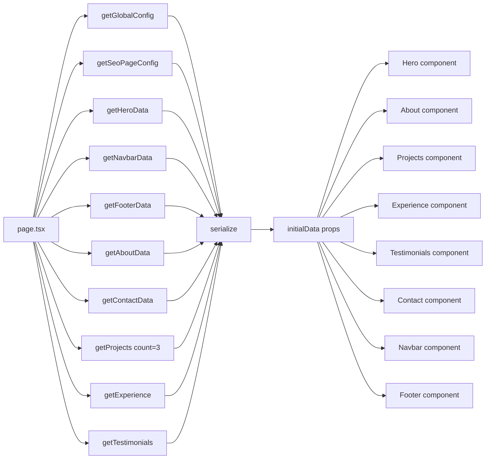
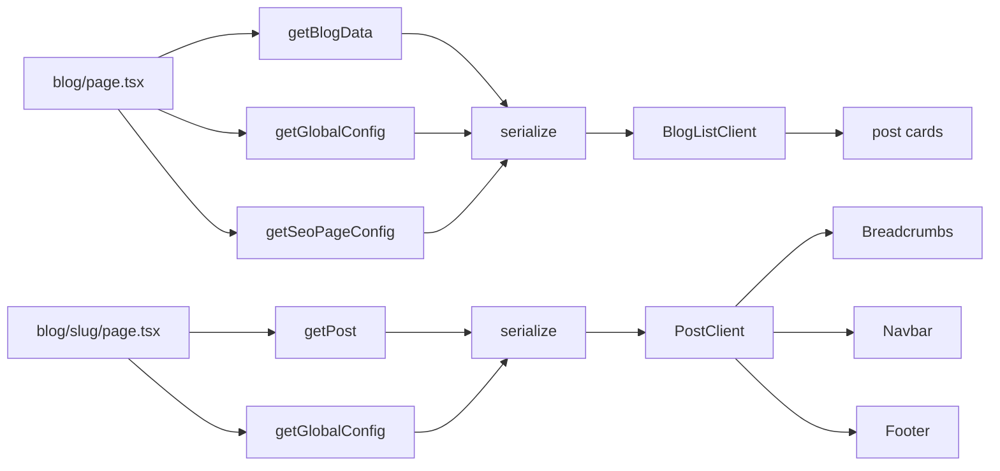
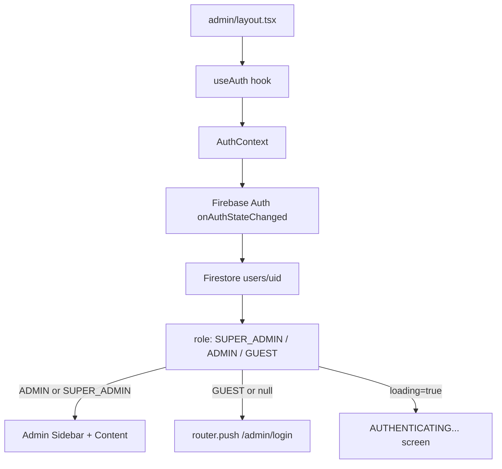
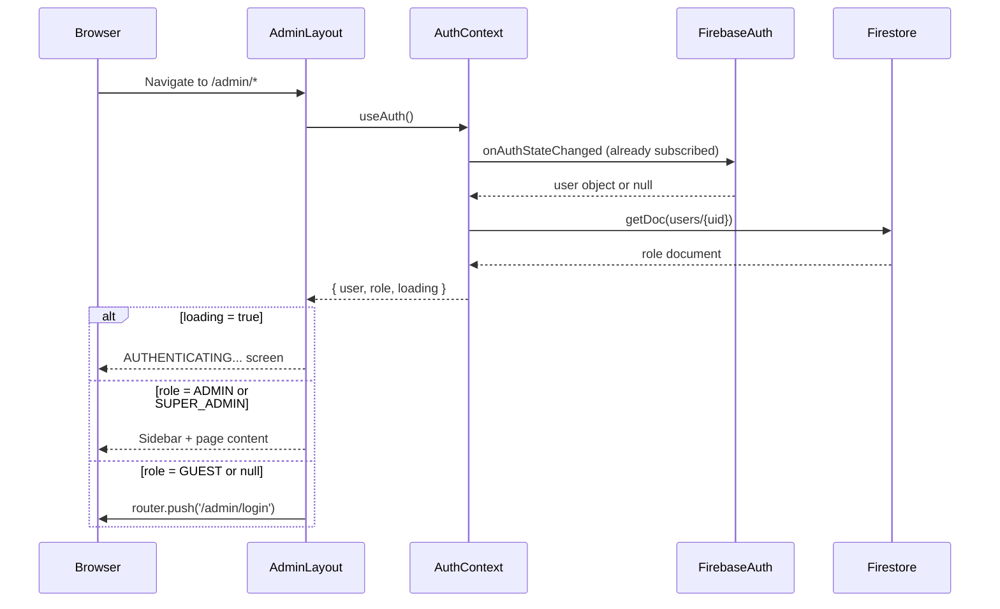
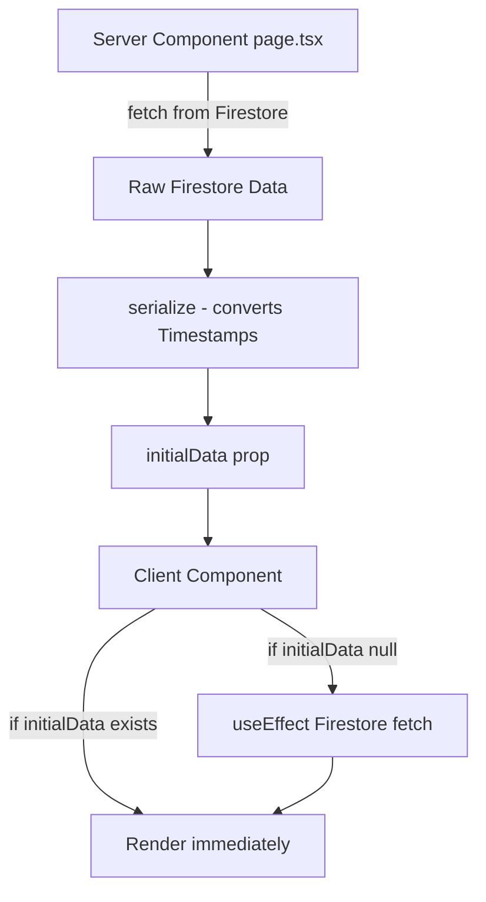
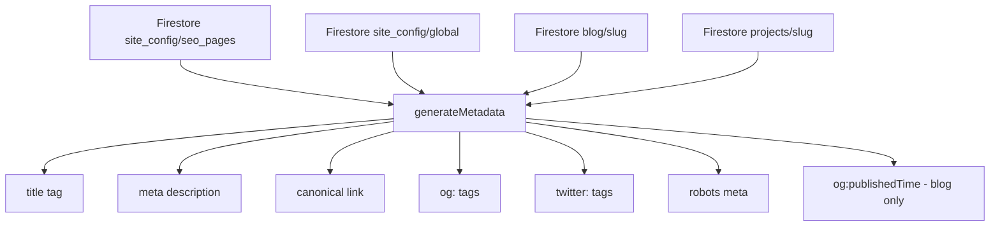

# Integration_Connections.md — System Wiring and Dependency Map

## Executive Summary

This document maps every integration, dependency chain, and data flow in the Kartik Jindal portfolio and blog website. It is based on the Graphify dependency graph (252 nodes, 245 edges, 11 communities, `graphify-out/GRAPH_REPORT.md`) cross-validated against direct source code inspection.

The system is wired around four external services — **Firebase Firestore** (content + auth), **Firebase Auth** (identity), **AWS S3** (file storage), and **Google Fonts** (typography) — plus one internal AI module (**Genkit + Google AI**) that is installed but not connected to any public or admin UI.

The Graphify report identifies `toast()` as the single highest-connectivity node (29 edges), acting as a cross-community bridge across all admin operations. The `serialize()` function (8 edges) is the second most connected node and is the critical data transformation layer between Firestore Timestamps and JSON-serializable React props. `getGlobalConfig()` (6 edges) is the most-fetched Firestore function, appearing in every public page's server-side data pipeline.

**Key architectural facts confirmed by Graphify + source:**
- 11 distinct functional communities, with Community 10 (auth login flow) being the most cohesive (0.83)
- Community 4 (home page data pipeline) and Community 8 (blog page pipeline) are tightly coupled around `getGlobalConfig()` and `serialize()`
- The Genkit AI module (`src/ai/`) is installed and configured but has zero connections to any route, component, or admin page — it is completely isolated
- `gsap` is listed as a dependency in `package.json` but no GSAP imports appear in any source file — it is an unused dependency
- Firebase Storage (`getStorage`) is initialized in `config.ts` but never used — all file storage goes through AWS S3

---

## 1. System Connection Map

```mermaid
graph TD
    subgraph "External Services"
        FS[Firebase Firestore]
        FA[Firebase Auth]
        S3[AWS S3]
        GF[Google Fonts CDN]
        GAI[Google AI / Gemini]
    end

    subgraph "Next.js App"
        subgraph "Public Routes"
            HP[/ Home Page]
            WP[/work Work Archive]
            WS[/work/slug Project Detail]
            WM[/work/@modal Modal]
            BP[/blog Blog List]
            BS[/blog/slug Blog Post]
        end

        subgraph "Admin Routes"
            AL[/admin/login]
            AD[/admin Dashboard]
            AH[/admin/hero]
            AA[/admin/about]
            APR[/admin/projects]
            ABL[/admin/blog]
            AE[/admin/experience]
            AT[/admin/testimonials]
            AC[/admin/contact]
            ALd[/admin/leads]
            ASEO[/admin/seo]
            AST[/admin/settings]
            AI[/admin/interface]
        end

        subgraph "Shared Infrastructure"
            AUTH[AuthContext]
            TOAST[useToast / toast]
            SER[serialize()]
            S3A[uploadToS3 Server Action]
            SEOHUD[SeoHud Component]
            GK[Genkit AI - UNUSED]
        end

        subgraph "Public Components"
            NAV[Navbar]
            HERO[Hero]
            H3D[Hero3D Three.js]
            ABOUT[About]
            PROJ[Projects]
            EXP[Experience]
            TEST[Testimonials]
            CONT[Contact]
            FOOT[Footer]
            BLOG[BlogListClient]
            POST[PostClient]
            CURSOR[CustomCursor]
            SCROLL[ScrollIndicator]
            INTRO[IntroScreen]
            MODAL[ModalWrapper]
            PDC[ProjectDetailContent]
            BREAD[Breadcrumbs]
        end
    end

    GF -->|font stylesheet link| HP
    FA -->|onAuthStateChanged| AUTH
    AUTH -->|user, role, loading| AL
    AUTH -->|user, role, loading| AD
    FS -->|site_config/hero| HP
    FS -->|site_config/about| HP
    FS -->|site_config/contact| HP
    FS -->|site_config/navbar| HP
    FS -->|site_config/footer| HP
    FS -->|site_config/global| HP
    FS -->|site_config/seo_pages| HP
    FS -->|projects collection| HP
    FS -->|experience collection| HP
    FS -->|testimonials collection| HP
    FS -->|blog collection| BP
    FS -->|blog/slug| BS
    FS -->|projects/slug| WS
    FS -->|projects collection| WP
    FS -->|contact_leads| CONT
    FS -->|contact_leads| ALd
    S3 -->|image URLs stored in Firestore| PROJ
    S3 -->|image URLs stored in Firestore| POST
    S3A -->|PutObjectCommand| S3
    GAI -.->|configured but unused| GK
```

---

## 2. Component and Route Relationships

### 2.1 Root Layout → Global Providers

`src/app/layout.tsx` is the root of all wiring. It mounts:

| Mount | Type | Scope |
|---|---|---|
| `<AuthProvider>` | Context Provider | Wraps entire app — all routes |
| `<Hero3D>` | Three.js scene | Fixed `inset-0 z-0` — visible on all pages |
| `<CustomCursor>` | Portal to `document.body` | Desktop only, all pages |
| `<Toaster>` | Toast renderer | All pages |
| Google Fonts `<link>` | External CDN | All pages |
| Grain overlay `<div>` | CSS texture | Fixed `inset-0 z-1` — all pages |

**Implicit contract:** Every page in the app inherits the Three.js background, custom cursor, auth context, and toast system. There is no way to opt out of these at the page level without modifying `layout.tsx`.

### 2.2 Home Page Data Pipeline (Graphify Community 4)

`src/app/page.tsx` is the most data-intensive route. It runs 9 parallel Firestore reads server-side:



**`serialize()` is the critical bridge** between Firestore Timestamps (which are not JSON-serializable) and React props. It converts `{ seconds, nanoseconds }` objects to millisecond timestamps. Without it, passing Firestore data from Server Components to Client Components would throw a serialization error.

### 2.3 Blog Pipeline (Graphify Community 8)



### 2.4 Work/Project Pipeline (Graphify Community 5 + 7)

```mermaid
graph LR
    WPG[work/page.tsx] --> GEX[getExperiments]
    WPG --> GFL[getFlagships]
    WPG --> GGC[getGlobalConfig]
    WPG --> GSPC[getSeoPageConfig]
    GEX --> SER[serialize]
    GFL --> SER
    GGC --> SER
    SER --> WC[WorkClient]
    WC --> PROJ[Projects component]

    WMP[work/@modal/slug/page.tsx] --> GPR[getProject]
    GPR --> SER2[serialize]
    SER2 --> MW[ModalWrapper]
    MW --> PDC[ProjectDetailContent isModal=true]

    WSP[work/slug/page.tsx] --> GPR2[getProject]
    GPR2 --> SER3[serialize]
    SER3 --> PDC2[ProjectDetailContent isModal=false]
```

### 2.5 Admin Layout → Auth Guard



### 2.6 Parallel Route Modal Wiring

```mermaid
graph TD
    WL[work/layout.tsx] --> CH[children slot]
    WL --> MO[modal slot]
    CH --> WP[work/page.tsx WorkClient]
    MO --> MD[work/@modal/default.tsx returns null]
    WP -->|Link scroll=false to /work/slug| INTERCEPT[Next.js intercepts]
    INTERCEPT --> WMP[work/@modal/slug/page.tsx]
    WMP --> MW[ModalWrapper Dialog]
    MW --> PDC[ProjectDetailContent isModal=true]
    MW -->|onOpenChange false| RB[router.back]
    RB --> WP
```

**Key contract:** `scroll={false}` on project links is what triggers the parallel route interception. Without it, Next.js would do a full navigation to `/work/[slug]` and bypass the modal.

### 2.7 Shared Component Usage Map

| Component | Used In |
|---|---|
| `Navbar` | `/`, `/work`, `/work/[slug]`, `/blog`, `/blog/[slug]` |
| `Footer` | `/`, `/work`, `/work/[slug]`, `/blog`, `/blog/[slug]` |
| `Contact` | `/`, `/blog` |
| `Projects` | `/` (limit=3), `/work` (hideHeader, all flagships) |
| `ProjectDetailContent` | `/work/[slug]` (isModal=false), `/work/@modal/(.)[slug]` (isModal=true) |
| `Breadcrumbs` | `/blog/[slug]`, `/work/[slug]` |
| `SeoHud` | `/admin/seo`, `/admin/blog/new`, `/admin/blog/[id]`, `/admin/projects/new`, `/admin/projects/[id]` |
| `Hero3D` | `layout.tsx` (global — all pages) |
| `CustomCursor` | `layout.tsx` (global — all pages) |
| `IntroScreen` | `/` only (skips admin routes internally) |
| `ScrollIndicator` | `/` only |

---

## 3. Data and Storage Connections

### 3.1 Firestore Collections and Their Consumers

| Collection / Document | Written By | Read By |
|---|---|---|
| `site_config/hero` | `/admin/hero` | `/` (server), `Hero` component (client fallback) |
| `site_config/about` | `/admin/about` | `/` (server), `About` component (client fallback) |
| `site_config/contact` | `/admin/contact` | `/` (server), `Contact` component (client fallback) |
| `site_config/navbar` | `/admin/interface` | `/` (server), `Navbar` component (client fallback) |
| `site_config/footer` | `/admin/interface` | `/`, `/work`, `/blog`, `/blog/[slug]`, `/work/[slug]` (server) |
| `site_config/global` | `/admin/settings` | All public pages (server), `AuthContext` (indirectly via identity) |
| `site_config/seo_pages` | `/admin/seo` | `/`, `/work`, `/blog` (server, generateMetadata) |
| `projects` | `/admin/projects/new`, `/admin/projects/[id]` | `/`, `/work`, `/work/[slug]`, `/work/@modal/(.)[slug]`, `sitemap.ts` |
| `blog` | `/admin/blog/new`, `/admin/blog/[id]` | `/blog`, `/blog/[slug]`, `sitemap.ts` |
| `experience` | `/admin/experience/new`, `/admin/experience/[id]` | `/` (server), `Experience` component (client fallback) |
| `testimonials` | `/admin/testimonials/new`, `/admin/testimonials/[id]` | `/` (server), `Testimonials` component (client fallback) |
| `contact_leads` | `Contact` component (public form submit) | `/admin/leads` |
| `users` | `AuthContext` (bootstrap), `/admin/login` (bootstrap) | `AuthContext` (role lookup) |

### 3.2 AWS S3 Integration

**Architecture:** S3 uploads use a Next.js Server Action (`'use server'` directive in `src/lib/aws/s3-actions.ts`). This means the AWS credentials never reach the browser — the upload is proxied through the Next.js server.

**Upload flow:**
```
Admin UI (Client Component)
  → FormData with file + path
  → uploadToS3(formData) [Server Action]
  → S3Client.send(PutObjectCommand)
  → AWS S3 Bucket
  → Returns { success: true, url: "https://bucket.s3.region.amazonaws.com/path/filename" }
  → URL stored in formData.image state
  → Saved to Firestore on form submit
```

**S3 path conventions:**
- Blog images: `blog/{timestamp}-{filename}`
- Project images: `projects/{timestamp}-{filename}`
- Resume PDFs: `resumes/{timestamp}-{filename}`

**URL construction:** Direct S3 URL (`https://{bucket}.s3.{region}.amazonaws.com/{key}`). No CloudFront CDN is configured — the code comment notes this as a consideration.

**Firebase Storage:** `getStorage(app)` is initialized in `src/lib/firebase/config.ts` and exported as `storage`, but it is **never imported or used anywhere in the codebase**. All file storage goes through AWS S3.

### 3.3 Environment Variable Dependencies

| Variable | Used In | Required |
|---|---|---|
| `NEXT_PUBLIC_FIREBASE_API_KEY` | `src/lib/firebase/config.ts` | Yes (has "dummy-key-for-dev" fallback) |
| `NEXT_PUBLIC_FIREBASE_AUTH_DOMAIN` | `src/lib/firebase/config.ts` | Yes |
| `NEXT_PUBLIC_FIREBASE_PROJECT_ID` | `src/lib/firebase/config.ts` | Yes (has "demo-project" fallback) |
| `NEXT_PUBLIC_FIREBASE_STORAGE_BUCKET` | `src/lib/firebase/config.ts` | No (Firebase Storage unused) |
| `NEXT_PUBLIC_FIREBASE_MESSAGING_SENDER_ID` | `src/lib/firebase/config.ts` | Yes |
| `NEXT_PUBLIC_FIREBASE_APP_ID` | `src/lib/firebase/config.ts` | Yes |
| `AWS_REGION` | `src/lib/aws/s3-actions.ts` | Yes (S3 uploads) |
| `AWS_ACCESS_KEY_ID` | `src/lib/aws/s3-actions.ts` | Yes (S3 uploads) |
| `AWS_SECRET_ACCESS_KEY` | `src/lib/aws/s3-actions.ts` | Yes (S3 uploads) |
| `AWS_S3_BUCKET_NAME` | `src/lib/aws/s3-actions.ts` | Yes (S3 uploads) |
| `NEXT_PUBLIC_BASE_URL` | All `generateMetadata`, `sitemap.ts`, `robots.ts` | Yes (defaults to `https://kartikjindal.com`) |
| `GOOGLE_GENAI_API_KEY` | Genkit (implicit) | No (Genkit unused in production) |

**`NEXT_PUBLIC_*` variables** are embedded in the client bundle at build time. The Firebase config is fully exposed to the browser — this is standard Firebase practice but means Firestore security rules are the only protection against unauthorized reads/writes.


---

## 4. Auth and Admin Wiring

### 4.1 AuthContext as the Central Auth Hub

`src/context/auth-context.tsx` is mounted once in `layout.tsx` and provides auth state to the entire app via React Context. It is the only place where Firebase Auth is subscribed to.

**Data flow:**
```
Firebase Auth (onAuthStateChanged)
  → user object (Firebase User | null)
  → Firestore users/{uid} lookup
  → role string (SUPER_ADMIN | ADMIN | GUEST)
  → AuthContext.Provider value: { user, role, loading, signOut }
  → useAuth() hook consumed by:
      - src/app/(admin)/admin/layout.tsx (route guard)
      - src/app/(admin)/admin/layout.tsx (display user email + role in header)
```

**Bootstrap contract:** The `OWNER_EMAIL` constant (`kartikjindal2003@gmail.com`) is hardcoded in both `auth-context.tsx` and `admin/login/page.tsx`. If the owner's email changes, it must be updated in both files.

### 4.2 Admin Route Guard Chain



**Gap:** This guard is entirely client-side. The server renders the admin layout HTML before the auth check completes. A user who knows the URL can briefly see the admin shell before being redirected. No Next.js middleware (`middleware.ts`) exists to block server-side rendering of admin routes.

### 4.3 Login Flow Connections

`src/app/(admin)/admin/login/page.tsx` connects to:
- `firebase/auth`: `signInWithEmailAndPassword`, `signInWithPopup`, `GoogleAuthProvider`
- `src/lib/firebase/config.ts`: `auth` instance
- `src/lib/firebase/config.ts`: `db` instance (for `checkAdminAccess`)
- `src/hooks/use-toast.ts`: feedback on success/failure
- `next/navigation`: `useRouter` for redirect after login

### 4.4 Admin Content Write Pattern

Every admin editor follows the same write pattern:

```
User edits form fields
  → Local useState(formData) updates
  → User clicks Save button
  → handleSubmit / handleSave called
  → Firestore write: setDoc or updateDoc
  → toast({ title: 'Success' }) or toast({ variant: 'destructive', title: 'Error' })
  → router.push('/admin/[section]') (for item editors)
     OR stay on page (for config editors)
```

**`toast()` as the universal feedback bridge (Graphify god node, 29 edges):** Every admin operation — create, update, delete, bulk action, upload, SEO sync — calls `toast()`. This is why Graphify identifies it as the highest-connectivity node. It is the single cross-cutting concern that connects all 11 communities.

---

## 5. Public Content Wiring

### 5.1 Server-Side Data → Client Component Props Pattern

All public pages use a consistent pattern: server components fetch data, serialize it, and pass it as `initialData` props to client components. Client components have a fallback `useEffect` fetch if `initialData` is null.



**This creates a dual-fetch risk:** If the server fetch fails silently (returns null), the client component will make a second Firestore read on mount. This doubles the Firestore read cost for error cases.

### 5.2 Content Update Propagation

When an admin updates content, the change propagates as follows:

```
Admin writes to Firestore
  → Firestore document updated
  → Next.js page uses force-dynamic (no cache)
  → Next page request hits Firestore fresh
  → New data rendered in HTML
  → User sees updated content on next page load
```

**There is no real-time subscription on public pages.** Changes are not pushed to active browser sessions. A user viewing the home page will not see content updates until they reload.

**There is no ISR or cache invalidation.** `force-dynamic` means every request is a fresh server render. This is the simplest approach but the most expensive in terms of Firestore reads and TTFB.

### 5.3 Contact Form → Leads Inbox Connection

```mermaid
graph LR
    PF[Public Contact Form] -->|addDoc| CL[contact_leads collection]
    CL -->|getDocs ordered by createdAt| LI[/admin/leads Inbox]
    LI -->|updateDoc status| CL
    LI -->|deleteDoc| CL
```

The contact form is the only public-to-admin data pipeline. All other data flows from admin → public.

### 5.4 Component Client-Side Fallback Fetches

These components fetch from Firestore client-side if `initialData` is not provided:

| Component | Firestore Path | Condition |
|---|---|---|
| `Hero` | `site_config/hero` | `!initialData` |
| `About` | `site_config/about` | `!initialData` |
| `Contact` | `site_config/contact` | `!initialData` |
| `Navbar` | `site_config/navbar` | `!navConfig` |
| `Footer` | `site_config/footer` | `!footerLayout` |
| `Projects` | `projects` collection | `!initialData` |
| `Experience` | `experience` collection | `!initialData` |
| `Testimonials` | `testimonials` collection | `!initialData` |

On the home page, all of these receive `initialData` from the server. On other pages (e.g., `/work`, `/blog`), components like `Navbar` and `Footer` do not receive `initialData` — they always fetch client-side.

---

## 6. SEO and Routing Connections

### 6.1 Metadata Generation Pipeline



**`generateMetadata` is called server-side** for every page request (due to `force-dynamic`). It reads from Firestore on every request — there is no caching of metadata.

### 6.2 Sitemap Connection

`src/app/sitemap.ts` connects to:
- `src/lib/firebase/config.ts` → `db` instance
- `blog` collection (all published posts → slug + createdAt)
- `projects` collection (all published projects → slug + createdAt)

The sitemap is generated dynamically on every request to `/sitemap.xml`. It has no caching layer.

### 6.3 Robots Connection

`src/app/robots.ts` connects to:
- `process.env.NEXT_PUBLIC_BASE_URL` for the sitemap URL

It has no Firestore dependency — it is a pure function returning a static configuration.

### 6.4 JSON-LD Structured Data Connections

| Schema | Location | Data Source |
|---|---|---|
| `Person` | `src/app/page.tsx` (server) | `config.identity.*`, `config.socials.*`, `heroData.*` from Firestore |
| `BlogPosting` | `src/app/blog/[slug]/post-client.tsx` (client) | `post.*` from Firestore, `config.identity.*` |

**Critical gap:** The `BlogPosting` schema is emitted from a Client Component (`'use client'`). This means it is rendered by JavaScript, not in the initial HTML. Googlebot may not see it on the first HTML response.

**The admin editor JSON-LD preview** (`generateSchemaPreview()` in blog/project editors) generates a preview schema in the browser but this schema is **never emitted on the public page**. The AEO/GEO fields (quickAnswer, takeaways, faqs, facts, citations) stored in Firestore are not connected to any public rendering or JSON-LD output.

---

## 7. Genkit / AI Module Analysis

### 7.1 What Is Installed

```json
"@genkit-ai/google-genai": "^1.28.0",
"genkit": "^1.28.0",
"genkit-cli": "^1.28.0"
```

### 7.2 What Is Configured

`src/ai/genkit.ts`:
```typescript
import {genkit} from 'genkit';
import {googleAI} from '@genkit-ai/google-genai';

export const ai = genkit({
  plugins: [googleAI()],
  model: 'googleai/gemini-2.5-flash',
});
```

`src/ai/dev.ts`:
```typescript
// Flows will be imported for their side effects in this file.
// (empty — no flows defined)
```

### 7.3 Connection Status

**The Genkit module is completely isolated.** Confirmed by:
- `src/ai/dev.ts` is empty (no flow imports)
- No component, route, or admin page imports from `src/ai/genkit.ts`
- No API routes exist that call `ai.generate()` or any Genkit flow
- The `genkit:dev` and `genkit:watch` npm scripts exist but serve no production purpose

**Intended use (inferred):** The admin blog editor has AEO/GEO fields (Quick Answer, Key Takeaways, FAQs, Hard Facts, Citations) and a "Sync with Content" button. The Genkit setup suggests these fields were intended to be auto-populated by AI — but the implementation was never completed. The "Sync with Content" button only copies existing form fields (title → SEO title, summary → SEO description) — it does not call any AI.

**`gsap` dependency:** Listed in `package.json` (`"gsap": "^3.12.5"`) but no GSAP imports exist in any source file. It is an unused dependency that adds ~100KB to the bundle.

---

## 8. Hook and Utility Dependency Map

### 8.1 `useToast` / `toast` (Graphify God Node — 29 edges)

`src/hooks/use-toast.ts` implements a module-level singleton state machine (not React state). The `toast()` function can be called from anywhere — including non-React contexts — because it uses a module-level `memoryState` and `listeners` array.

**Consumers:**
- All 12 admin page components (via `useToast()`)
- `src/components/ui/toaster.tsx` (renders the toast UI)
- `src/app/layout.tsx` (mounts `<Toaster>`)

**Architecture note:** Because `toast()` uses module-level state, it persists across React renders and component unmounts. This is why Graphify identifies it as a cross-community bridge — it is the only truly global state in the application.

### 8.2 `serialize()` (Graphify God Node — 8 edges)

Defined locally in each server-side page file (not a shared utility). It appears in:
- `src/app/page.tsx`
- `src/app/blog/page.tsx`
- `src/app/blog/[slug]/page.tsx`
- `src/app/work/page.tsx`
- `src/app/work/[slug]/page.tsx`
- `src/app/work/@modal/(.)[slug]/page.tsx`

**It is duplicated 6 times** — identical implementation in each file. This is a refactoring opportunity: a single `src/lib/serialize.ts` utility would eliminate the duplication.

### 8.3 `cn()` Utility

`src/lib/utils.ts` exports `cn()` (clsx + tailwind-merge). Used throughout all components for conditional class merging. It has no external service dependencies.

### 8.4 `useIsMobile()` Hook

`src/hooks/use-mobile.tsx` — uses `window.matchMedia` with 768px breakpoint. Used only in `src/components/ui/sidebar.tsx` (the shadcn sidebar component). **Not used by any portfolio component** — the portfolio uses Tailwind responsive classes directly.

### 8.5 `PlaceHolderImages`

`src/lib/placeholder-images.ts` exports a typed array from `placeholder-images.json`. It is defined but **not imported by any component or page** in the current codebase. It is an orphaned utility.

---

## 9. Integration Risks

### 9.1 High Severity

| Risk | Description | Location |
|---|---|---|
| Firebase config exposed client-side | All `NEXT_PUBLIC_FIREBASE_*` vars are in the browser bundle | `src/lib/firebase/config.ts` |
| No Firestore security rules visible | Client-side Firebase SDK means rules are the only server-side protection | Firestore console |
| No server-side admin route protection | Admin routes are only guarded client-side | `src/app/(admin)/admin/layout.tsx` |
| `dangerouslySetInnerHTML` on blog content | Blog post HTML rendered without visible sanitization | `src/app/blog/[slug]/post-client.tsx` |
| AWS credentials in server environment | `AWS_ACCESS_KEY_ID` and `AWS_SECRET_ACCESS_KEY` must be in server env | `src/lib/aws/s3-actions.ts` |
| `typescript: { ignoreBuildErrors: true }` | TypeScript errors are silently ignored at build time | `next.config.ts` |
| `eslint: { ignoreDuringBuilds: true }` | ESLint errors are silently ignored at build time | `next.config.ts` |

### 9.2 Medium Severity

| Risk | Description | Location |
|---|---|---|
| `force-dynamic` on all public pages | No caching — every request hits Firestore | All public page files |
| `serialize()` duplicated 6 times | Any bug fix must be applied in 6 places | All server page files |
| Firebase Storage initialized but unused | Dead code, potential confusion | `src/lib/firebase/config.ts` |
| `gsap` installed but unused | ~100KB unused bundle weight | `package.json` |
| Genkit installed but unused | Adds ~2MB+ to node_modules, no production value | `package.json`, `src/ai/` |
| S3 URLs are direct bucket URLs | No CDN — images served from S3 origin, no edge caching | `src/lib/aws/s3-actions.ts` |
| `images.remotePatterns: **` | All external image hostnames allowed — no domain restriction | `next.config.ts` |
| Dual-fetch risk on component fallbacks | Server fetch failure → silent null → client re-fetch | All public components |
| `NEXT_PUBLIC_BASE_URL` not validated | Wrong value breaks all canonicals, sitemap, and OG URLs | All `generateMetadata` |

### 9.3 Low Severity

| Risk | Description | Location |
|---|---|---|
| `PlaceHolderImages` orphaned | Exported but never imported | `src/lib/placeholder-images.ts` |
| `useIsMobile` not used by portfolio | Defined but only used by shadcn sidebar | `src/hooks/use-mobile.tsx` |
| `OWNER_EMAIL` hardcoded in two files | Must be updated in both if email changes | `auth-context.tsx`, `login/page.tsx` |
| `maxInstances: 1` in apphosting.yaml | Single instance — no auto-scaling | `apphosting.yaml` |
| Admin forms have no blocking validation | Empty required fields can be saved to Firestore | All admin editor pages |
| `BlogPosting` JSON-LD in Client Component | May not appear in initial HTML for Googlebot | `post-client.tsx` |

### 9.4 Implicit Contracts

These are undocumented dependencies that would break silently if violated:

| Contract | If Broken |
|---|---|
| `scroll={false}` on project links from `/work` | Modal route not intercepted — full page navigation instead |
| `status === 'published'` filter on public queries | Draft content would appear publicly |
| `type === 'FLAGSHIP'` filter for home/work flagship section | Experiments would appear in flagship slots |
| `order` field on projects and experience | Items appear in random Firestore order |
| `slug` field on blog posts and projects | URL resolution falls back to Firestore document ID |
| `NEXT_PUBLIC_BASE_URL` set correctly | All canonical URLs, sitemap, and OG URLs point to wrong domain |
| `OWNER_EMAIL` matches Firebase Auth email | Owner cannot bootstrap SUPER_ADMIN role |
| S3 bucket configured for public read | Image URLs return 403 — broken images site-wide |

---

## 10. Key Takeaways

1. **Firebase Firestore is the single source of truth for all content.** Every public section, every admin editor, every SEO field, and every metadata generator reads from or writes to Firestore. The entire site would be non-functional without a working Firestore connection.

2. **`serialize()` is a critical but duplicated bridge.** The function that converts Firestore Timestamps to JSON-serializable values appears identically in 6 files. It is the most important utility in the codebase and the most obvious refactoring target.

3. **`toast()` is the universal feedback mechanism.** Graphify correctly identifies it as the highest-connectivity node (29 edges). It is the only truly global state in the application and connects all admin communities.

4. **The Genkit AI module is installed but completely disconnected.** It has no routes, no flows, no UI connections, and no production use. The AEO/GEO admin fields suggest it was intended to power AI-assisted content generation, but the implementation was never completed. It adds significant dependency weight with zero production value.

5. **AWS S3 is the file storage layer, not Firebase Storage.** Firebase Storage is initialized but never used. All image and PDF uploads go through a Next.js Server Action that proxies to S3. The S3 URLs are stored in Firestore and served directly from the S3 origin — no CDN is configured.

6. **The parallel route modal pattern is the most architecturally sophisticated wiring in the codebase.** The `scroll={false}` contract on project links, the `@modal` parallel slot, the `default.tsx` null renders, and the `router.back()` close behavior form a precise chain that breaks if any link is removed.

7. **Admin route protection is client-side only.** There is no `middleware.ts` file. The admin layout guard runs after the server has already rendered the HTML. This is a security gap that should be addressed with Next.js middleware before any production deployment.

8. **The `next.config.ts` has two silent failure modes.** `typescript.ignoreBuildErrors: true` and `eslint.ignoreDuringBuilds: true` mean TypeScript and ESLint errors are suppressed at build time. The build will succeed even with type errors or lint violations.

9. **Content updates are not real-time and not cached.** `force-dynamic` means every page request hits Firestore fresh. There is no ISR, no cache, and no real-time subscription on public pages. This is the simplest architecture but the most expensive at scale.

10. **The system has three unused dependencies that should be cleaned up before sale or handoff:** `gsap` (installed, never imported), Firebase Storage (initialized, never used), and `PlaceHolderImages` (exported, never imported). Genkit should either be connected to a real AI flow or removed entirely.

---

*Document generated from Graphify report (`graphify-out/GRAPH_REPORT.md`, 252 nodes, 245 edges, 11 communities) cross-validated against direct source code inspection of all route files, component files, utility files, configuration files, and the package.json dependency manifest.*
