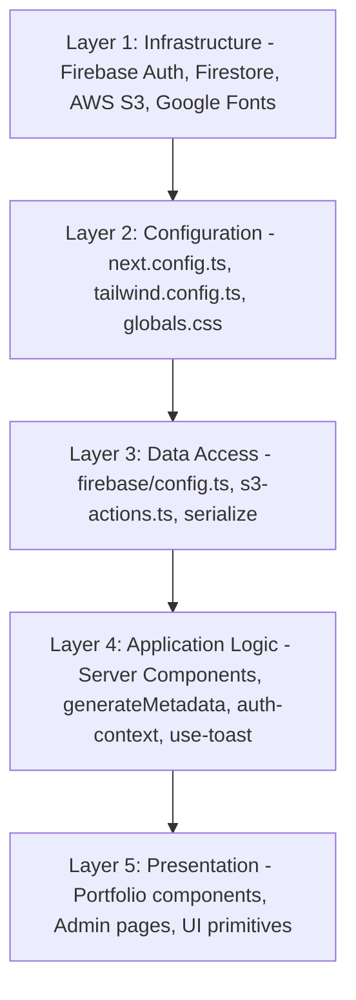
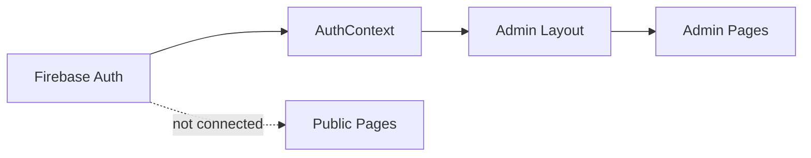
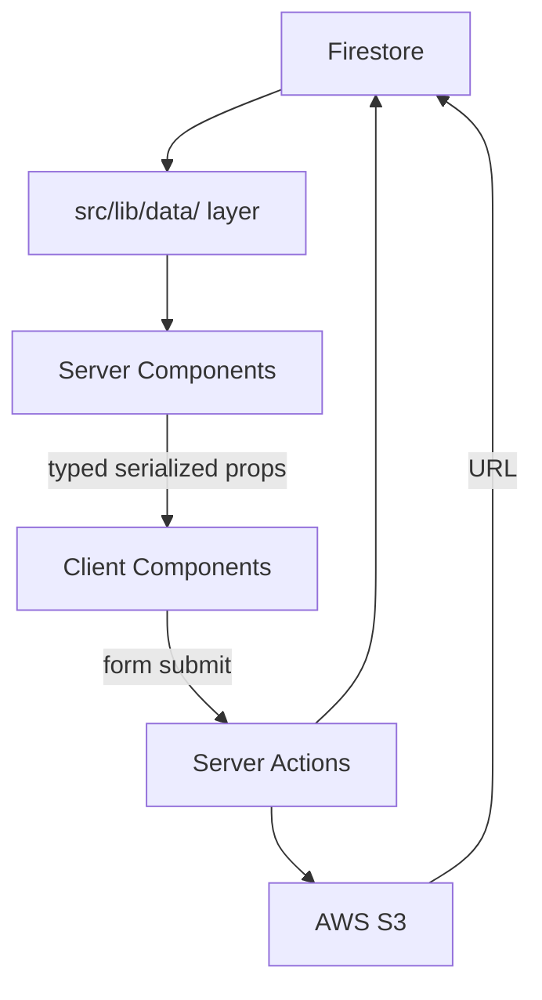

# Architecture.md — System Architecture Reference

## Executive Summary

This document describes the architecture of a Next.js 15 App Router portfolio and blog website with a full CMS admin panel. It serves two purposes: an accurate description of the current implementation, and a reusable reference architecture for rebuilding a similar system from scratch.

The system is built on a **server-first, client-enhanced** pattern. Server Components handle all data fetching and metadata generation. Client Components handle interactivity, animations, and form state. The public site and admin panel are cleanly separated by route groups. Firebase Firestore is the single source of truth for all content. AWS S3 handles file storage via a server-side proxy. Firebase Auth handles identity with a Firestore-backed role system.

**Graphify analysis confirms the architectural shape:** 11 dependency communities, with the tightest cohesion in the auth flow (Community 10: 0.83) and the data pipeline communities (Communities 7, 8: 0.5+). The weakest cohesion is in the admin CRUD community (Community 0: 0.08), confirming that admin operations lack a shared abstraction layer. The god node analysis identifies `toast()` (29 edges) as the only true cross-cutting concern — there is no shared service layer, no shared data access layer, and no shared validation layer.

---

## 1. Current Architecture

### 1.1 Overall Style

**Architecture style:** Server-first Next.js App Router with client-enhanced interactivity.

The system is not a traditional SPA. It is not a pure SSG site. It is a hybrid:
- Public pages are Server Components that fetch from Firestore and render HTML
- Client Components handle animations, scroll behavior, form state, and interactive UI
- Admin pages are entirely Client Components (no server-side data fetching in admin)
- The Three.js background, custom cursor, and intro screen are global Client Components mounted in the root layout

**Data flow direction:** Firestore → Server Component → serialized props → Client Component → rendered UI

### 1.2 Directory Structure

```
src/
├── ai/                          # Genkit AI (installed, unused)
│   ├── dev.ts                   # Empty — no flows defined
│   └── genkit.ts                # Gemini 2.5 Flash config
│
├── app/                         # Next.js App Router
│   ├── layout.tsx               # Root layout — global providers, 3D bg, cursor
│   ├── page.tsx                 # Home page (Server Component)
│   ├── globals.css              # Design tokens, utilities, animations
│   ├── robots.ts                # robots.txt generator
│   ├── sitemap.ts               # Dynamic sitemap generator
│   │
│   ├── (admin)/                 # Route group — admin surface
│   │   └── admin/
│   │       ├── layout.tsx       # Admin shell (sidebar, header, auth guard)
│   │       ├── page.tsx         # Dashboard
│   │       ├── login/           # Login page
│   │       ├── hero/            # Hero section editor
│   │       ├── about/           # About section editor
│   │       ├── projects/        # Projects CRUD
│   │       ├── blog/            # Blog CRUD
│   │       ├── experience/      # Experience CRUD
│   │       ├── testimonials/    # Testimonials CRUD
│   │       ├── contact/         # Contact module editor
│   │       ├── leads/           # Contact leads inbox
│   │       ├── seo/             # SEO metadata panel
│   │       ├── settings/        # Global settings
│   │       └── interface/       # Layout config (nav + footer)
│   │
│   ├── blog/                    # Blog public surface
│   │   ├── page.tsx             # Blog list (Server Component)
│   │   └── [slug]/
│   │       ├── page.tsx         # Blog post (Server Component)
│   │       └── post-client.tsx  # Blog post UI (Client Component)
│   │
│   └── work/                    # Work public surface
│       ├── layout.tsx           # Parallel route layout (children + modal)
│       ├── page.tsx             # Work archive (Server Component)
│       ├── work-client.tsx      # Work archive UI (Client Component)
│       ├── default.tsx          # Parallel route default (null)
│       ├── [slug]/
│       │   └── page.tsx         # Project detail full page
│       └── @modal/              # Parallel route slot
│           ├── default.tsx      # Modal default (null)
│           └── (.)[slug]/
│               └── page.tsx     # Project detail modal (intercepting route)
│
├── components/
│   ├── admin/
│   │   └── seo-hud.tsx          # SEO score + SERP preview widget
│   ├── portfolio/               # Domain components (public site)
│   │   ├── hero.tsx
│   │   ├── hero-3d.tsx          # Three.js WebGL scene
│   │   ├── navbar.tsx
│   │   ├── intro-screen.tsx
│   │   ├── about.tsx
│   │   ├── projects.tsx
│   │   ├── experience.tsx
│   │   ├── testimonials.tsx
│   │   ├── contact.tsx
│   │   ├── footer.tsx
│   │   ├── blog-list-client.tsx
│   │   ├── project-detail-content.tsx
│   │   ├── modal-wrapper.tsx
│   │   ├── custom-cursor.tsx
│   │   ├── scroll-indicator.tsx
│   │   └── breadcrumbs.tsx
│   └── ui/                      # shadcn/Radix primitives
│
├── context/
│   └── auth-context.tsx         # Firebase Auth + Firestore role context
│
├── hooks/
│   ├── use-toast.ts             # Module-level toast state machine
│   └── use-mobile.tsx           # 768px breakpoint hook
│
└── lib/
    ├── aws/
    │   └── s3-actions.ts        # Server Action for S3 uploads
    ├── firebase/
    │   └── config.ts            # Firebase app initialization
    ├── utils.ts                 # cn() utility
    └── placeholder-images.ts    # Orphaned utility (unused)
```

### 1.3 Route Architecture

```mermaid
graph TD
    ROOT[src/app/layout.tsx Root Layout]
    ROOT --> HOME[page.tsx Home - Server Component]
    ROOT --> BLOG[blog/page.tsx Blog List - Server Component]
    ROOT --> BLOGPOST[blog/slug/page.tsx Blog Post - Server Component]
    ROOT --> WORK[work/page.tsx Work Archive - Server Component]
    ROOT --> WORKSLUG[work/slug/page.tsx Project Full Page]
    ROOT --> ADMIN[admin/layout.tsx Admin Shell - Client Component]
    WORK --> WORKLAYOUT[work/layout.tsx Parallel Route Layout]
    WORKLAYOUT --> WORKMODAL[work/@modal/slug/page.tsx Project Modal]
    WORKLAYOUT --> WORKDEFAULT[work/default.tsx null]
    ADMIN --> ADMINLOGIN[admin/login/page.tsx]
    ADMIN --> ADMINDASH[admin/page.tsx Dashboard]
    ADMIN --> ADMINCONTENT[admin/hero, about, projects, blog, experience, testimonials, contact, leads, seo, settings, interface]
```

### 1.4 Server vs Client Component Boundary

**Server Components (no `'use client'`):**
- All public page files (`page.tsx`)
- `src/app/sitemap.ts`, `src/app/robots.ts`
- `src/lib/aws/s3-actions.ts` (`'use server'` Server Action)

**Client Components (`'use client'`):**
- All portfolio section components
- All admin page files
- `src/context/auth-context.tsx`
- `src/hooks/use-toast.ts`
- `src/components/portfolio/custom-cursor.tsx`
- `src/components/portfolio/hero-3d.tsx`
- `src/components/portfolio/intro-screen.tsx`
- `src/app/blog/[slug]/post-client.tsx`
- `src/app/work/work-client.tsx`

**The pattern:** Server Components fetch data and pass it as `initialData` props to Client Components. Client Components render the UI with animations and interactivity. Client Components also have a fallback `useEffect` fetch if `initialData` is null.

### 1.5 Data Fetching Pattern

The home page demonstrates the canonical pattern used across all public pages:

```typescript
// 1. React.cache() wraps each Firestore fetch for deduplication
const getGlobalConfig = cache(async function getGlobalConfig() {
  const docSnap = await getDoc(doc(db, 'site_config', 'global'));
  return docSnap.exists() ? serialize(docSnap.data()) : null;
});

// 2. serialize() converts Firestore Timestamps to JSON-serializable values
function serialize(data: any) {
  return JSON.parse(JSON.stringify(data, (key, value) => {
    if (value?.seconds !== undefined && value?.nanoseconds !== undefined) {
      return new Date(value.seconds * 1000).getTime();
    }
    return value;
  }));
}

// 3. Server Component fetches all data and passes as props
export default async function Home() {
  const config = await getGlobalConfig();
  const heroData = await getHeroData();
  return <Hero initialData={heroData} />;
}
```

`React.cache()` is used on home, blog, and work pages (confirmed in latest source). This deduplicates Firestore reads when `generateMetadata` and the page component both call the same function.

### 1.6 Admin Architecture

- **Route group:** `(admin)` — groups files without affecting URLs
- **Layout:** `src/app/(admin)/admin/layout.tsx` — Client Component wrapping its own `AuthProvider` and `Toaster`
- **Auth guard:** `useEffect` in `AdminLayoutContent` redirects to `/admin/login` if not authenticated
- **All admin pages:** Client Components with local `useState`, direct Firestore SDK calls

The root layout does NOT mount `AuthProvider` (confirmed in latest `layout.tsx`). The admin layout mounts its own `AuthProvider` — public pages have zero auth overhead.

---

## 2. Architectural Layers



### Layer 1: Infrastructure

| Service | Purpose | SDK |
|---|---|---|
| Firebase Firestore | All content storage | `firebase/firestore` (client SDK) |
| Firebase Auth | Identity + session | `firebase/auth` (client SDK) |
| AWS S3 | File storage (images, PDFs) | `@aws-sdk/client-s3` (server-side only) |
| Google Fonts CDN | Typography | `<link>` tag in `<head>` |
| Firebase App Hosting | Deployment | `apphosting.yaml` |

**Key constraint:** Firebase is used via the **client SDK** on both server and client. Firestore security rules are the only server-side protection. There is no Firebase Admin SDK usage.

### Layer 2: Configuration

| File | Controls |
|---|---|
| `next.config.ts` | Build behavior, image domains, TypeScript/ESLint suppression |
| `tailwind.config.ts` | Design tokens, font families, custom animations, typography plugin |
| `src/app/globals.css` | CSS custom properties, utility classes (`.glass`, `.text-outline`, `.bg-grain`) |
| `components.json` | shadcn/ui configuration, path aliases |

### Layer 3: Data Access

| Module | Role |
|---|---|
| `src/lib/firebase/config.ts` | Firebase app singleton — exports `auth`, `db`, `storage` |
| `src/lib/aws/s3-actions.ts` | Server Action — proxies file uploads to S3 |
| `serialize()` (inline, 6 copies) | Converts Firestore Timestamps to JSON numbers |
| `React.cache()` (wrapping fetch functions) | Deduplicates Firestore reads within a single request |

**The missing abstraction:** There is no `src/lib/data/` layer. All Firestore queries are written inline in page files. This is the primary architectural weakness.

### Layer 4: Application Logic

| Module | Role |
|---|---|
| `src/context/auth-context.tsx` | Firebase Auth subscription, Firestore role lookup, `useAuth()` hook |
| `src/hooks/use-toast.ts` | Module-level toast state machine, `toast()` function |
| `src/lib/utils.ts` | `cn()` — clsx + tailwind-merge |
| `generateMetadata()` (per page) | SEO metadata generation from Firestore |
| `src/app/sitemap.ts` | Dynamic sitemap from Firestore |
| `src/app/robots.ts` | robots.txt configuration |

### Layer 5: Presentation

Three sub-layers:

**5a. UI Primitives** (`src/components/ui/`): shadcn/Radix components. Generic, unstyled-by-default, themed via CSS variables. No domain knowledge.

**5b. Domain Components** (`src/components/portfolio/`): Portfolio-specific components. Consume Firestore data via `initialData` props. Have fallback `useEffect` fetches.

**5c. Admin Pages** (`src/app/(admin)/admin/`): Full-page Client Components. Self-contained — fetch own data, manage own form state, write directly to Firestore.

---

## 3. Data and State Boundaries

### 3.1 Firestore Data Boundary

**Server-side (public pages):**
- Called from Server Components using the client SDK
- Data serialized via `serialize()` before passing to Client Components
- `React.cache()` deduplicates reads within a single request
- No real-time subscriptions — data fetched once per request

**Client-side (admin pages + component fallbacks):**
- Called directly from Client Components via `useEffect`
- No serialization needed
- No caching — every component mount triggers a fresh read

### 3.2 State Architecture

No global client-side state management library. State at three levels:

| Level | Implementation | Scope |
|---|---|---|
| Module-level | `use-toast.ts` `memoryState` + `listeners` | Global — callable from anywhere |
| Context | `AuthContext` — `user`, `role`, `loading` | Admin subtree only |
| Component | `useState` for form data, list data, UI state | Local to each component |

No shared state between public and admin surfaces. Public pages have no knowledge of auth state.

### 3.3 S3 Storage Boundary

```
Client Component (admin editor)
  → FormData with file
  → uploadToS3(formData) [Server Action boundary]
  → AWS SDK PutObjectCommand [server-side only]
  → S3 bucket
  → Returns { success, url }
  → URL stored in local state → saved to Firestore on form submit
```

AWS credentials never reach the browser. This is the correct pattern.

### 3.4 Auth State Boundary



The public site has no auth context. The admin layout mounts its own `AuthProvider`. Clean separation.

---

## 4. Public vs Admin Separation

### 4.1 Route Separation

| Aspect | Public Site | Admin Panel |
|---|---|---|
| Layout | `src/app/layout.tsx` | `src/app/(admin)/admin/layout.tsx` |
| Auth | None | Firebase Auth + Firestore roles |
| Data fetching | Server Components | Client Components (`useEffect`) |
| State | Props + local state | Local `useState` |
| Providers | None | `AuthProvider` + `Toaster` |
| Background | Three.js WebGL scene | Grain texture only |

### 4.2 Shared Elements

- Design system: Same Tailwind tokens, same CSS variables, same `.glass` utility
- UI primitives: Same `src/components/ui/` components
- Firebase config: Same `src/lib/firebase/config.ts` singleton
- `cn()` utility: Same `src/lib/utils.ts`
- `SeoHud` component: Used in admin SEO panel and admin blog/project editors

### 4.3 The Implicit Contract

The public site and admin panel share a Firestore schema contract. If an admin editor saves a field with a different name than what the public component reads, the public site silently shows the fallback value. This contract is not documented or enforced by TypeScript — it is implicit and fragile.

---

## 5. Recommended Rebuild Architecture

### 5.1 Recommended Directory Structure

```
src/
├── app/
│   ├── layout.tsx               # Root layout — fonts, global CSS only
│   ├── (public)/                # Route group for public site
│   │   ├── layout.tsx           # Public layout — Hero3D, Cursor, IntroScreen
│   │   ├── page.tsx             # Home
│   │   ├── blog/
│   │   └── work/
│   ├── (admin)/                 # Route group for admin
│   │   ├── layout.tsx           # Admin layout — AuthProvider, sidebar
│   │   └── admin/
│   ├── sitemap.ts
│   └── robots.ts
│
├── components/
│   ├── ui/                      # shadcn primitives (unchanged)
│   ├── portfolio/               # Domain components (typed props, no fallback fetches)
│   └── admin/                   # Admin-specific components
│
├── lib/
│   ├── firebase/
│   │   ├── config.ts            # Firebase client singleton
│   │   └── admin.ts             # Firebase Admin SDK (for middleware)
│   ├── aws/
│   │   └── s3-actions.ts        # Server Action (unchanged)
│   ├── data/                    # NEW: Centralized data access layer
│   │   ├── site-config.ts       # getGlobalConfig, getHeroData, etc.
│   │   ├── projects.ts          # getProject, getFlagships, getExperiments
│   │   ├── blog.ts              # getPost, getBlogData
│   │   └── serialize.ts         # Single serialize() utility
│   ├── types/                   # NEW: TypeScript interfaces
│   │   ├── content.ts           # Project, BlogPost, Experience, etc.
│   │   └── config.ts            # SiteConfig, SeoFields, etc.
│   └── utils.ts                 # cn() (unchanged)
│
├── context/
│   └── auth-context.tsx         # Unchanged
│
├── hooks/
│   ├── use-toast.ts             # Unchanged
│   ├── use-mobile.tsx           # Unchanged
│   └── use-admin-crud.ts        # NEW: Shared admin CRUD hook
│
└── middleware.ts                # NEW: Server-side admin route protection
```

### 5.2 Key Architectural Improvements

**1. Centralized data access layer (`src/lib/data/`):**

```typescript
// src/lib/data/projects.ts
import { cache } from 'react';
import { db } from '@/lib/firebase/config';
import { serialize } from './serialize';
import type { Project } from '@/lib/types/content';

export const getProject = cache(async (slug: string): Promise<Project | null> => {
  const q = query(collection(db, 'projects'), where('slug', '==', slug), limit(1));
  const snap = await getDocs(q);
  if (!snap.empty) return serialize({ id: snap.docs[0].id, ...snap.docs[0].data() });
  const docSnap = await getDoc(doc(db, 'projects', slug));
  return docSnap.exists() ? serialize({ id: docSnap.id, ...docSnap.data() }) : null;
});

export const getFlagships = cache(async (): Promise<Project[]> => {
  const q = query(collection(db, 'projects'), where('status', '==', 'published'));
  const snap = await getDocs(q);
  return snap.docs
    .map(d => serialize({ id: d.id, ...d.data() }) as Project)
    .filter(p => p.type === 'FLAGSHIP')
    .sort((a, b) => (a.order || 0) - (b.order || 0));
});
```

**2. Shared `serialize()` utility (`src/lib/data/serialize.ts`):**

```typescript
export function serialize<T>(data: T): T {
  if (!data) return data;
  return JSON.parse(JSON.stringify(data, (_, value) => {
    if (value?.seconds !== undefined && value?.nanoseconds !== undefined) {
      return new Date(value.seconds * 1000).getTime();
    }
    return value;
  }));
}
```

**3. TypeScript content types (`src/lib/types/content.ts`):**

```typescript
export interface Project {
  id: string;
  title: string;
  slug: string;
  type: 'FLAGSHIP' | 'EXPERIMENT';
  status: 'published' | 'draft';
  desc: string;
  longDesc?: string;
  image?: string;
  tech: string[];
  order: number;
  seo?: SeoFields;
  aeo?: AeoFields;
  entity?: EntityFields;
}

export interface BlogPost {
  id: string;
  title: string;
  slug: string;
  status: 'published' | 'draft';
  summary: string;
  content: string;
  categories: string[];
  image?: string;
  createdAt: number;
  seo?: SeoFields;
}

export interface SeoFields {
  title?: string;
  description?: string;
  keywords?: string;
  ogImage?: string;
  indexable?: boolean;
  canonicalUrl?: string;
}
```

**4. Server-side admin protection (`src/middleware.ts`):**

```typescript
import { NextResponse } from 'next/server';
import type { NextRequest } from 'next/server';

export function middleware(request: NextRequest) {
  const session = request.cookies.get('__session');
  const isAdminRoute = request.nextUrl.pathname.startsWith('/admin');
  const isLoginPage = request.nextUrl.pathname === '/admin/login';

  if (isAdminRoute && !isLoginPage && !session) {
    return NextResponse.redirect(new URL('/admin/login', request.url));
  }
}

export const config = { matcher: ['/admin/:path*'] };
```

**5. Shared admin CRUD hook (`src/hooks/use-admin-crud.ts`):**

```typescript
export function useAdminCrud(collectionName: string) {
  const { toast } = useToast();

  const deleteItem = async (id: string) => {
    try {
      await deleteDoc(doc(db, collectionName, id));
      toast({ title: 'Deleted' });
      return true;
    } catch (e: any) {
      toast({ variant: 'destructive', title: 'Error', description: e.message });
      return false;
    }
  };

  const toggleStatus = async (id: string, current: string) => {
    const next = current === 'published' ? 'draft' : 'published';
    try {
      await updateDoc(doc(db, collectionName, id), { status: next });
      toast({ title: 'Status updated', description: `Marked as ${next}` });
      return next;
    } catch (e: any) {
      toast({ variant: 'destructive', title: 'Error', description: e.message });
      return current;
    }
  };

  const bulkDelete = async (ids: string[]) => {
    const batch = writeBatch(db);
    ids.forEach(id => batch.delete(doc(db, collectionName, id)));
    await batch.commit();
    toast({ title: 'Bulk delete complete' });
  };

  return { deleteItem, toggleStatus, bulkDelete };
}
```

**6. ISR instead of `force-dynamic`:**

```typescript
// Replace in all public page files:
// export const dynamic = 'force-dynamic';

// With:
export const revalidate = 60;   // home, blog list, work list
// or
export const revalidate = 3600; // individual posts and projects
```

**7. `next/font` instead of Google Fonts `<link>`:**

```typescript
import { Playfair_Display, PT_Sans } from 'next/font/google';

const playfair = Playfair_Display({
  subsets: ['latin'],
  variable: '--font-headline',
  display: 'swap',
});

const ptSans = PT_Sans({
  subsets: ['latin'],
  weight: ['400', '700'],
  variable: '--font-body',
  display: 'swap',
});
```

### 5.3 Recommended Data Flow (Rebuild)



### 5.4 Recommended Component Architecture (Rebuild)

```
Presentation Layer
├── UI Primitives (src/components/ui/)
│   └── Generic, unstyled, Radix-based
│       No domain knowledge, no Firestore
│
├── Domain Components (src/components/portfolio/)
│   └── Receive typed props (Project, BlogPost, etc.)
│       No direct Firestore access
│       No fallback useEffect fetches
│
└── Page Components (src/app/**/page.tsx)
    └── Server Components only
        Fetch from src/lib/data/ layer
        Pass typed props to domain components
        Export generateMetadata
```

The key change: **Domain components should not have fallback `useEffect` fetches.** Data fetching belongs in Server Components only.

---

## 6. Strengths

**Route architecture:** The parallel route modal pattern (`work/@modal/(.)[slug]`) is the most sophisticated routing decision in the codebase. It correctly uses Next.js intercepting routes to render project details as a modal when navigated from the work list, and as a full page on direct URL access. The `default.tsx` null renders and `scroll={false}` link contract are correctly implemented.

**Server/Client Component separation:** The pattern of Server Components fetching data and passing it as `initialData` props to Client Components is correct and well-executed. `React.cache()` for deduplication between `generateMetadata` and the page component is a good optimization.

**S3 Server Action:** Using a Next.js Server Action for S3 uploads is the correct pattern. AWS credentials never reach the browser. This is secure and clean.

**Auth architecture:** The `AuthContext` pattern — Firebase Auth subscription + Firestore role lookup + owner bootstrapping — is clean and self-contained. The admin layout mounting its own `AuthProvider` (separate from the root layout) is correct.

**Design system:** The CSS variable token system combined with Tailwind's `hsl(var(--token))` pattern is the correct approach for a themeable design system. The `.glass`, `.text-outline`, `.text-gradient`, and `.bg-grain` utility classes are well-named and consistently used.

**Graphify Community 10 (Auth) — 0.83 cohesion:** The login flow is tight, well-bounded, and easy to understand.

---

## 7. Weaknesses

**No data access layer (Graphify: `serialize()` has 8 edges, duplicated 6 times):** All Firestore queries are inline in page files. `serialize()` is duplicated 6 times. There is no single place to change a query, add caching, or swap the data source.

**No TypeScript types for domain objects:** All admin forms use `useState<any>(null)`. All Firestore data is typed as `any`. TypeScript provides zero safety for the most important data in the application.

**No server-side admin protection:** The admin layout guard is a client-side `useEffect`. There is no `middleware.ts`. The server renders admin HTML before the auth check fires.

**Graphify Community 0 — 0.08 cohesion (Admin CRUD):** Every admin page implements its own `handleDelete`, `handleSubmit`, `toggleStatus`, `handleBulkDelete`, `handleBulkStatus` independently. No shared hook, no shared service, no shared error handling.

**Component fallback fetches create dual-fetch risk:** Every domain component has a `useEffect` fallback that re-fetches from Firestore if `initialData` is null. On pages where `initialData` is not passed, this triggers unnecessary client-side Firestore reads.

**`force-dynamic` disables all caching:** All public pages opt out of Next.js caching. For a portfolio site with infrequently changing content, ISR is the correct approach.

**Build pipeline suppresses errors:** `typescript.ignoreBuildErrors: true` and `eslint.ignoreDuringBuilds: true` mean the build succeeds regardless of type errors.

---

## 8. Key Takeaways

1. **The Server Component → serialized props → Client Component pattern is correct and should be preserved in any rebuild.** It is the right way to use Next.js App Router for a content-driven site.

2. **The parallel route modal pattern is the most reusable architectural decision.** The `@modal` slot + intercepting route + `default.tsx` null + `scroll={false}` link contract is a clean, reusable pattern for any site that needs modal-on-list, full-page-on-direct-URL behavior.

3. **The missing data access layer is the most impactful architectural gap.** A `src/lib/data/` directory with typed, cached, reusable Firestore query functions would eliminate the `serialize()` duplication, enable TypeScript safety, and make the codebase significantly more maintainable.

4. **The admin CRUD pattern needs a shared hook.** Graphify's Community 0 cohesion score of 0.08 is the quantitative confirmation that admin operations are structurally fragile. A `useAdminCrud()` hook would reduce boilerplate by ~70% and centralize error handling.

5. **`React.cache()` is already being used correctly** (confirmed in latest source on home, blog, and work pages). This pattern should be extended to all data fetching functions in the recommended data access layer.

6. **The design system is reusable as-is.** The CSS variable token system, Tailwind configuration, glassmorphism utilities, and shadcn/Radix component setup can be lifted directly into any new project.

7. **The auth architecture is clean and reusable.** The `AuthContext` + Firestore role lookup + owner bootstrapping pattern works well for single-owner or small-team admin panels. The only addition needed is a `middleware.ts` for server-side protection.

8. **ISR is the correct caching strategy for this type of site.** `revalidate = 60` on list pages and `revalidate = 3600` on detail pages would reduce Firestore reads by 95%+ while keeping content fresh.

9. **The S3 Server Action pattern is the correct approach for file uploads in Next.js.** It should be preserved exactly as-is in any rebuild. The only improvement is adding file type validation and size limits.

10. **For a rebuild, the recommended architecture adds three things the current implementation lacks:** a typed data access layer (`src/lib/data/`), server-side middleware protection (`middleware.ts`), and a shared admin CRUD hook (`use-admin-crud.ts`). Everything else — the route structure, the component hierarchy, the design system, the auth pattern, the S3 pattern — is worth keeping.

---

*Document generated from Graphify report (252 nodes, 245 edges, 11 communities) cross-validated against direct source code inspection of `src/app/layout.tsx`, `src/app/(admin)/admin/layout.tsx`, `src/app/work/layout.tsx`, `src/app/page.tsx`, `src/app/blog/page.tsx`, `src/app/work/page.tsx`, `src/context/auth-context.tsx`, `src/lib/firebase/config.ts`, `src/lib/aws/s3-actions.ts`, `next.config.ts`, `tailwind.config.ts`, and `components.json`.*
