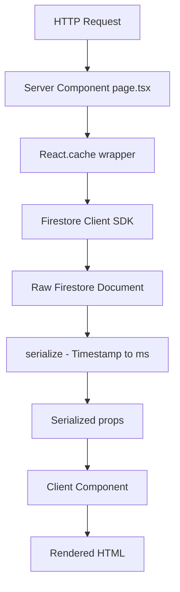
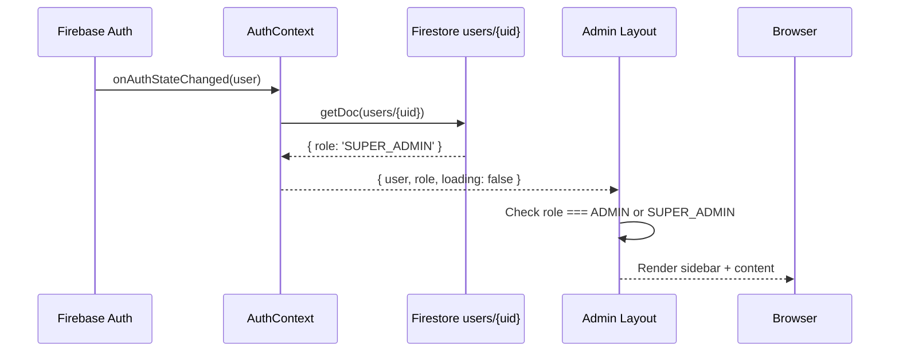
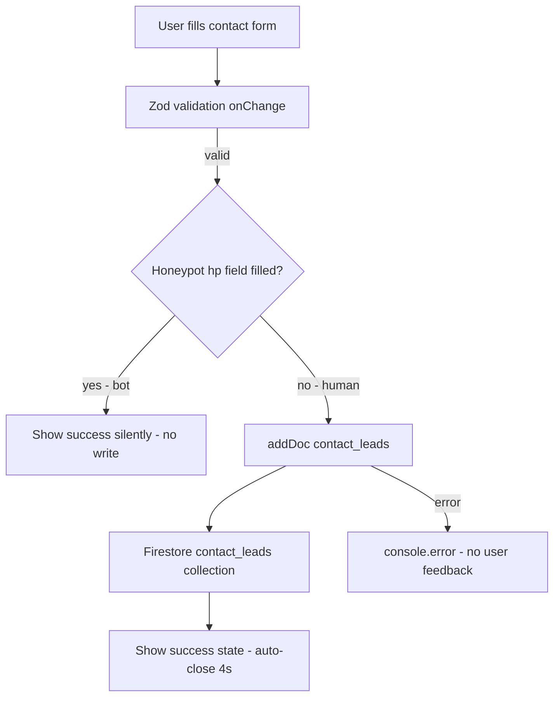
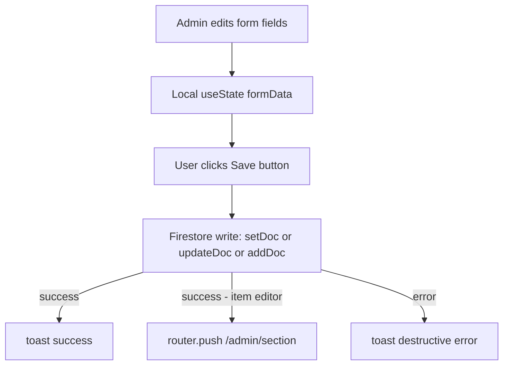
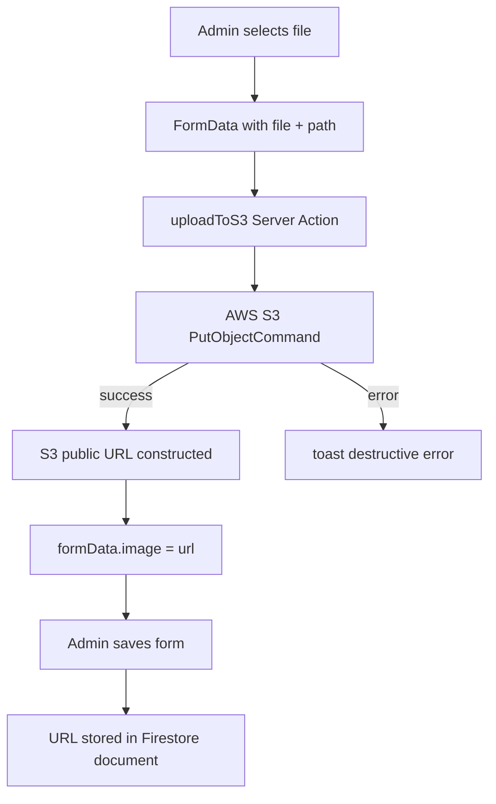
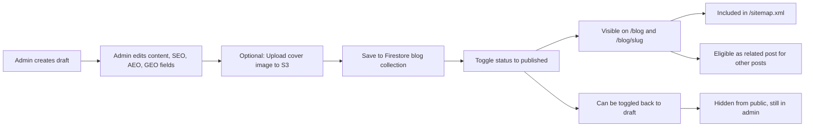
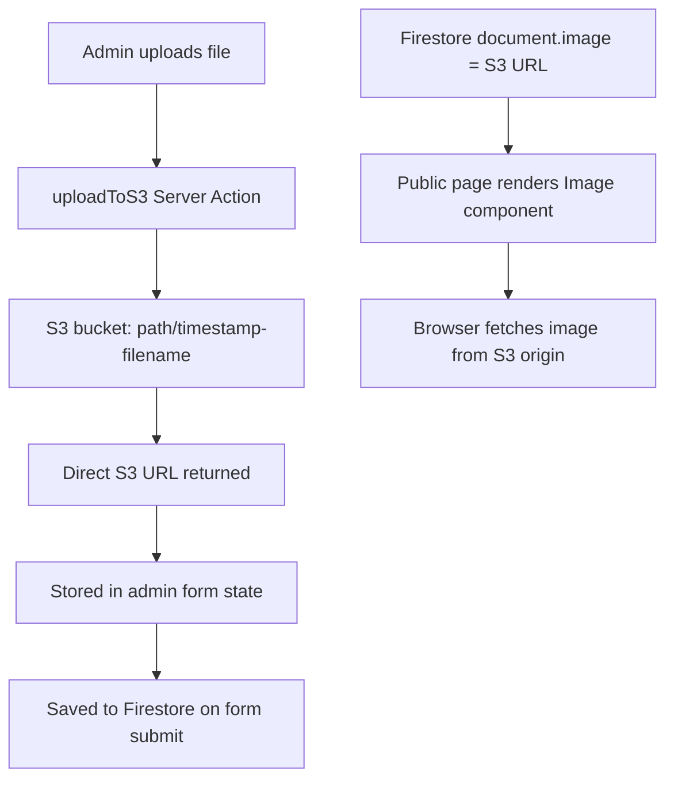
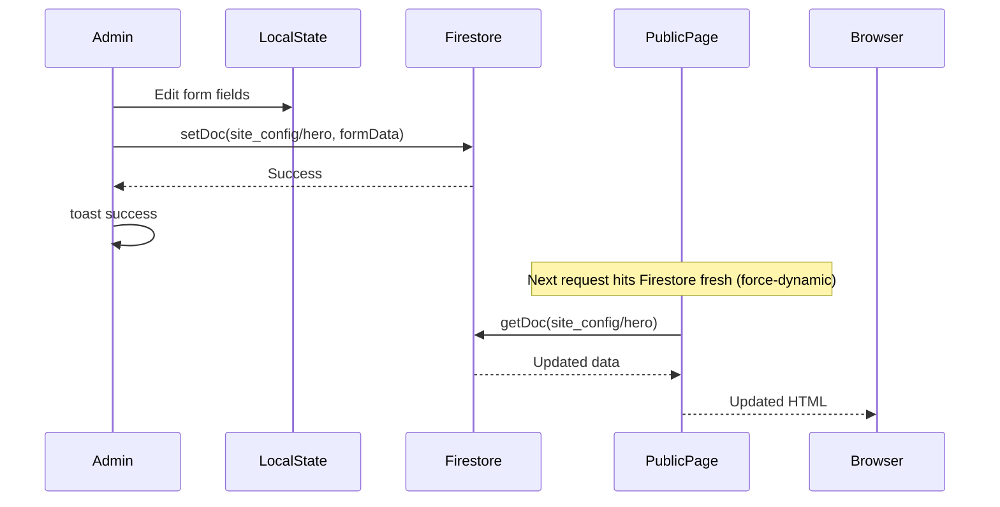
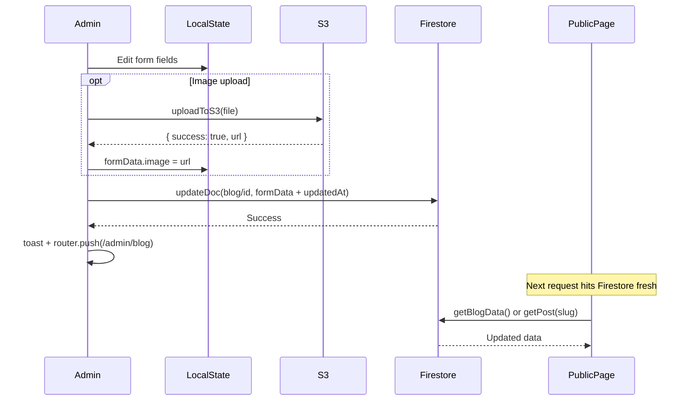
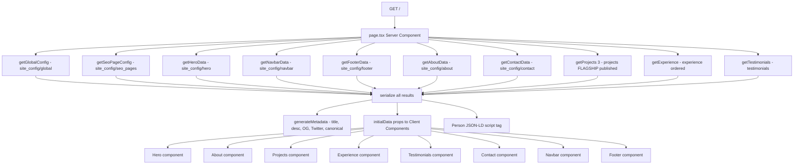

# Data_Flow.md — Application Data Flow Reference

## Executive Summary

This document maps every data flow in the application — how data originates, transforms, moves between layers, and reaches the UI. It is grounded in direct source code inspection of all data-critical files, cross-referenced with the Graphify dependency graph.

**The system has one source of truth: Firebase Firestore.** All content — portfolio sections, blog posts, projects, experience, testimonials, contact config, SEO metadata, and user roles — lives in Firestore. AWS S3 stores binary assets (images, PDFs). The S3 URLs are then stored back in Firestore, making Firestore the index for all assets.

**Graphify confirms the data flow communities:**
- Community 4 (cohesion 0.27): `getGlobalConfig`, `getHeroData`, `getAboutData`, `getContactData`, `getFooterData`, `getNavbarData`, `getSeoPageConfig`, `generateMetadata` — the home page data pipeline
- Community 5 (cohesion 0.44): `getProject`, `serialize`, `BlogDetailPage`, `ProjectPage`, `ProjectModalPage` — the project/blog detail pipeline
- Community 8 (cohesion 0.57): `getBlogData`, `getGlobalConfig`, `serialize`, `BlogPage` — the blog list pipeline
- `serialize()` appears as a god node with 8 edges — it is the critical transformation layer between raw Firestore data and JSON-serializable React props

**Key data flow facts confirmed from latest source:**
- The Firebase module has been refactored: `src/lib/firebase/app.ts` initializes the app, `src/lib/firebase/firestore.ts` exports `db`, `src/lib/firebase/config.ts` re-exports all four modules
- The blog post page now fetches `relatedPosts` and `relatedProjects` server-side via `Promise.all`, but `post-client.tsx` does not yet render them — data is fetched but unused
- The blog new page now includes a `featured: false` field in the form data schema
- The home page `Projects` component now receives a `useModal` prop

---

## 1. Data Sources

### 1.1 Firestore Collections

| Collection | Purpose | Written By | Read By |
|---|---|---|---|
| `site_config/global` | Author identity, socials, resume URL, visibility toggles, SEO defaults | `/admin/settings` | All public pages, JSON-LD schema |
| `site_config/hero` | Hero section copy (badge, title, description, CTAs) | `/admin/hero` | `/` (home) |
| `site_config/about` | About section copy (headline, narrative, pillars, skills, stats, quote) | `/admin/about` | `/` (home) |
| `site_config/contact` | Contact section copy (badge, headline, form labels/placeholders) | `/admin/contact` | `/`, `/blog` |
| `site_config/navbar` | Nav items array | `/admin/interface` | All public pages (Navbar component) |
| `site_config/footer` | Footer bio, est mark, footer links | `/admin/interface` | All public pages (Footer component) |
| `site_config/seo_pages` | Per-page SEO overrides (home, work, blog) | `/admin/seo` | All public pages (generateMetadata) |
| `projects` | Project documents (title, slug, desc, image, tech, status, type, order, seo, aeo, entity) | `/admin/projects/new`, `/admin/projects/[id]` | `/`, `/work`, `/work/[slug]`, `/work/@modal/[slug]`, `sitemap.ts` |
| `blog` | Blog post documents (title, slug, content, summary, categories, status, seo, aeo, entity, featured) | `/admin/blog/new`, `/admin/blog/[id]` | `/blog`, `/blog/[slug]`, `sitemap.ts` |
| `experience` | Career timeline entries (company, role, period, desc, order) | `/admin/experience/new`, `/admin/experience/[id]` | `/` (home) |
| `testimonials` | Testimonial documents (name, position, text, avatar) | `/admin/testimonials/new`, `/admin/testimonials/[id]` | `/` (home) |
| `contact_leads` | Contact form submissions (name, email, subject, message, status, metadata) | `Contact` component (public form) | `/admin/leads` |
| `users` | User role documents (email, role, displayName, photoURL) | `AuthContext` (bootstrap), `/admin/login` (bootstrap) | `AuthContext` (role lookup) |

### 1.2 AWS S3 Buckets

| Path Prefix | Content | Written By | Read By |
|---|---|---|---|
| `blog/` | Blog post cover images | `/admin/blog/new`, `/admin/blog/[id]` | `BlogListClient`, `PostClient` (via Firestore URL) |
| `projects/` | Project cover images | `/admin/projects/new`, `/admin/projects/[id]` | `Projects`, `ProjectDetailContent` (via Firestore URL) |
| `resumes/` | Resume PDF files | `/admin/settings` | `Navbar` (via Firestore URL in `config.resume.fileUrl`) |

### 1.3 Environment Variables as Data Sources

| Variable | Used In | Data Provided |
|---|---|---|
| `NEXT_PUBLIC_FIREBASE_*` | `src/lib/firebase/app.ts` | Firebase connection config |
| `AWS_REGION`, `AWS_ACCESS_KEY_ID`, `AWS_SECRET_ACCESS_KEY`, `AWS_S3_BUCKET_NAME` | `src/lib/aws/s3-actions.ts` | S3 connection config |
| `NEXT_PUBLIC_BASE_URL` | All `generateMetadata`, `sitemap.ts`, `robots.ts` | Canonical URL base |

---

## 2. Read Flow

### 2.1 The `serialize()` Transformation

Every Firestore read on the server side passes through `serialize()` before the data can be passed as props to Client Components. This is the critical transformation layer.

```typescript
function serialize(data: any) {
  if (!data) return data;
  return JSON.parse(JSON.stringify(data, (key, value) => {
    if (value && typeof value === 'object' &&
        value.seconds !== undefined && value.nanoseconds !== undefined) {
      return new Date(value.seconds * 1000).getTime();
    }
    return value;
  }));
}
```

**What it does:** Converts Firestore `Timestamp` objects (`{ seconds, nanoseconds }`) to Unix millisecond numbers. Without this, passing Firestore data from a Server Component to a Client Component throws a serialization error because Timestamps are not plain JSON.

**Where it lives:** Duplicated inline in 6 page files:
- `src/app/page.tsx`
- `src/app/blog/page.tsx`
- `src/app/blog/[slug]/page.tsx`
- `src/app/work/page.tsx`
- `src/app/work/[slug]/page.tsx`
- `src/app/work/@modal/(.)[slug]/page.tsx`

### 2.2 `React.cache()` Deduplication

All data fetching functions on public pages are wrapped with `React.cache()`. This deduplicates Firestore reads within a single request — if `generateMetadata` and the page component both call `getGlobalConfig()`, Firestore is only queried once.

```typescript
const getGlobalConfig = cache(async function getGlobalConfig() {
  const docSnap = await getDoc(doc(db, 'site_config', 'global'));
  return docSnap.exists() ? serialize(docSnap.data()) : null;
});
```

**Scope:** `React.cache()` deduplication is per-request only. It does not persist across requests. Combined with `force-dynamic`, every page request makes fresh Firestore reads.

### 2.3 Server-Side Read Flow (Public Pages)



### 2.4 Client-Side Fallback Read Flow

Every public domain component has a `useEffect` fallback that reads from Firestore if `initialData` is null:

```typescript
useEffect(() => {
  if (!initialData) {
    const fetchHero = async () => {
      const docSnap = await getDoc(doc(db, 'site_config', 'hero'));
      if (docSnap.exists()) setData(docSnap.data());
    };
    fetchHero();
  }
}, [initialData]);
```

**When this fires:** On pages where the component is used but `initialData` is not passed from the server. For example, `Navbar` and `Footer` on `/work` and `/blog` pages do not receive `initialData` — they always fetch client-side.

**Risk:** If the server fetch fails silently (returns null), the client re-fetches — doubling the Firestore read cost for error cases.

### 2.5 Admin Read Flow

Admin pages fetch data entirely client-side via `useEffect`:

```typescript
useEffect(() => {
  const fetchSettings = async () => {
    const docSnap = await getDoc(doc(db, 'site_config', 'global'));
    if (docSnap.exists()) setSettings(docSnap.data());
  };
  fetchSettings();
}, []);
```

No `serialize()` is needed in admin pages because the data stays in the Client Component — it is never passed across the Server/Client boundary.

### 2.6 Auth Read Flow



### 2.7 Related Content Read Flow (Blog Post)

The blog post page now fetches related content server-side using `Promise.all`:

```typescript
const [relatedPosts, relatedProjects] = post
  ? await Promise.all([
    getRelatedPosts(post.id, categories),   // up to 10 blog posts, scored by category overlap
    getRelatedProjects(categories),          // up to 20 projects, scored by tech/category overlap
  ])
  : [[], []];
```

**Scoring algorithm for related posts:** Fetches up to 10 published posts, excludes current post, scores by category overlap count, sorts by score then `createdAt` descending, returns top 3.

**Scoring algorithm for related projects:** Fetches up to 20 published projects, scores by tech array and role field overlap with post categories (case-insensitive substring matching), returns top 3.

**Current state:** These are fetched and passed to `PostClient` as props, but `PostClient` does not render them. The data pipeline is complete; the UI is not.

---

## 3. Write Flow

### 3.1 Contact Form Write Flow (Public → Firestore)

This is the only public-facing write operation in the entire application.



**Written document structure:**
```typescript
{
  name: string,
  email: string,
  subject: string,
  message: string,
  status: 'new',
  createdAt: serverTimestamp(),
  metadata: {
    userAgent: navigator.userAgent,
    platform: navigator.platform,
  }
}
```

**Gap:** The `catch` block in `onSubmit` only calls `console.error` — there is no user-facing error toast if the Firestore write fails.

### 3.2 Admin Content Write Flow

All admin write operations follow the same pattern:



**Write operations by type:**

| Operation | Firestore Method | Used For |
|---|---|---|
| `setDoc` | Overwrites entire document | `site_config/*` editors (hero, about, contact, navbar, footer, global, seo_pages) |
| `addDoc` | Creates new document with auto-ID | New blog posts, new projects, new experience, new testimonials |
| `updateDoc` | Partial update | Edit existing blog/project/experience/testimonial, toggle status, bulk status, leads read/unread |
| `deleteDoc` | Delete document | Delete blog/project/experience/testimonial/lead |
| `writeBatch` | Atomic batch | Bulk delete, bulk status update |

### 3.3 S3 Asset Write Flow



**URL construction:**
```typescript
const url = `https://${process.env.AWS_S3_BUCKET_NAME}.s3.${process.env.AWS_REGION}.amazonaws.com/${key}`;
```

**Key naming:** `{path}/{timestamp}-{sanitized-filename}` — e.g., `blog/1714500000000-my-cover-image.jpg`

**Security:** The `'use server'` directive on `s3-actions.ts` ensures AWS credentials never reach the browser. The upload is proxied through the Next.js server.

**Gap:** No file type validation beyond `accept="image/*"` on the input. No file size limit. No virus scanning.

### 3.4 Auth Write Flow (Bootstrap)

When a user logs in for the first time and no `users/{uid}` document exists:

```typescript
const initialRole = user.email === OWNER_EMAIL ? 'SUPER_ADMIN' : 'GUEST';
await setDoc(userRef, {
  email: user.email,
  role: initialRole,
  displayName: user.displayName || 'Admin',
  photoURL: user.photoURL || '',
  createdAt: serverTimestamp()
});
```

This happens in two places: `AuthContext` (on any auth state change) and `/admin/login` (on login). Both use the same `OWNER_EMAIL` constant.

---

## 4. Content Lifecycle

### 4.1 Blog Post Lifecycle



**Status field:** `'draft'` | `'published'`

**Public filter:** `where('status', '==', 'published')` — only published posts appear on public pages

**New field in latest source:** `featured: false` — added to the blog form schema but not yet used in any public rendering or filtering logic

### 4.2 Project Lifecycle

Same pattern as blog posts, with additional fields:
- `type: 'FLAGSHIP' | 'EXPERIMENT'` — determines which section it appears in
- `order: number` — controls display order within its type
- `accentColor: string` — hex color for the hover glow effect on project cards

### 4.3 Site Config Lifecycle

Site config documents (`site_config/*`) have no status field — they are always "live". Changes take effect on the next page request (since `force-dynamic` is used on public pages).

---

## 5. Asset Lifecycle



**No CDN:** Images are served directly from S3 origin. There is no CloudFront distribution. This means:
- No edge caching for images
- No automatic image resizing or format conversion
- Latency depends on S3 region proximity to the user

**No deletion:** When an admin replaces an image, the old S3 object is not deleted. S3 storage accumulates over time.

**Next.js Image optimization:** Public pages use `<Image>` from `next/image` which proxies and optimizes images through Next.js. Admin pages use raw `` tags for previews.

---

## 6. Admin Update Flow

### 6.1 Section Config Update (Hero, About, Contact, etc.)



**Propagation delay:** Changes are visible on the next page request. There is no real-time push to active browser sessions. A user viewing the home page will not see changes until they reload.

### 6.2 Blog/Project CRUD Update



### 6.3 Bulk Operations

Bulk status updates and bulk deletes use Firestore `writeBatch`:

```typescript
const batch = writeBatch(db);
selectedIds.forEach(id => {
  batch.update(doc(db, 'blog', id), { status });
});
await batch.commit();
```

This is atomic — either all updates succeed or none do. The local state is updated optimistically after the batch commits.

---

## 7. Public Render Flow

### 7.1 Home Page Full Data Flow



**Note:** `React.cache()` ensures `getGlobalConfig()` and `getSeoPageConfig()` are called once even though both `generateMetadata` and the page component call them.

### 7.2 Blog Post Full Data Flow

```mermaid
graph TD
    REQ[GET /blog/slug] --> SC[blog/slug/page.tsx Server Component]
    SC --> GP[getPost slug - blog collection slug-first then ID fallback]
    SC --> GC[getGlobalConfig - site_config/global]
    GP --> SER[serialize]
    GC --> SER
    SER --> CATS[Extract categories from post]
    CATS --> RP[getRelatedPosts - blog published limit 10 scored by category]
    CATS --> RPJ[getRelatedProjects - projects published limit 20 scored by tech overlap]
    RP --> PA[Promise.all]
    RPJ --> PA
    PA --> PC[PostClient props: post, config, relatedPosts, relatedProjects]
    SER --> META[generateMetadata - title, desc, OG article, publishedTime, canonical]
    PC --> UI[Rendered blog post UI]
    PC --> JSONLD[BlogPosting JSON-LD in Client Component]
    Note over PC: relatedPosts and relatedProjects are passed but NOT rendered
```

---

## 8. Data Risks

### 8.1 High Severity

| Risk | Description | Location |
|---|---|---|
| No Firestore security rules visible | Firebase client SDK is used on both server and client. Rules are the only server-side protection. If rules are permissive, any user can read/write all data | Firestore console (not in codebase) |
| `dangerouslySetInnerHTML` on blog content | Blog post HTML is rendered without visible sanitization. XSS attack possible if admin account is compromised | `src/app/blog/[slug]/post-client.tsx` |
| Contact form error silently swallowed | `catch` block in `onSubmit` only calls `console.error`. User sees no feedback if Firestore write fails | `src/components/portfolio/contact.tsx` |
| `NEXT_PUBLIC_FIREBASE_*` exposed in browser | All Firebase config is in the client bundle. Firestore security rules are the only protection | `src/lib/firebase/app.ts` |
| No S3 file validation | No file type validation beyond HTML `accept` attribute. No size limit. No content scanning | `src/lib/aws/s3-actions.ts` |

### 8.2 Medium Severity

| Risk | Description | Location |
|---|---|---|
| `serialize()` duplicated 6 times | Any bug fix must be applied in 6 places. Graphify confirms it as a god node (8 edges) | All public page files |
| `force-dynamic` on all list pages | Every request hits Firestore. No caching. Costs scale linearly with traffic | `page.tsx`, `blog/page.tsx`, `work/page.tsx` |
| Dual-fetch risk on component fallbacks | Server fetch failure → silent null → client re-fetches. Doubles Firestore reads on error | All domain components |
| `relatedPosts`/`relatedProjects` fetched but unused | Two Firestore queries run on every blog post page load but the results are never rendered | `src/app/blog/[slug]/page.tsx` |
| `featured` field stored but unused | New field in blog form schema but no public rendering or filtering logic uses it | `src/app/(admin)/admin/blog/new/page.tsx` |
| No S3 object deletion | Old images accumulate in S3 when replaced | `src/lib/aws/s3-actions.ts` |
| `lastModified: new Date()` in sitemap | Static pages always appear modified today. Wastes crawl budget | `src/app/sitemap.ts` |
| AEO/GEO fields stored but not rendered | Admin fills in quickAnswer, takeaways, faqs, facts, citations — none appear in public HTML or JSON-LD | All admin editors |

### 8.3 Low Severity

| Risk | Description | Location |
|---|---|---|
| `OWNER_EMAIL` hardcoded in two files | Must be updated in both if email changes | `auth-context.tsx`, `admin/login/page.tsx` |
| No `updatedAt` in sitemap | Sitemap uses `createdAt` for `lastModified`. Edited content shows stale date | `src/app/sitemap.ts` |
| Firebase Storage initialized but unused | `getStorage(app)` exported from `config.ts` but never imported anywhere | `src/lib/firebase/storage.ts` |
| Dashboard analytics are mock data | `chartData` is hardcoded. Activity log is static. Misleading to any buyer | `src/app/(admin)/admin/page.tsx` |

---

## 9. Key Takeaways

1. **Firestore is the single source of truth for everything.** All content, all config, all SEO metadata, all user roles, and all asset URLs live in Firestore. S3 stores the binary files; Firestore stores the URLs. This is a clean, correct architecture.

2. **`serialize()` is the most critical and most duplicated function.** It is the bridge between Firestore's Timestamp objects and JSON-serializable React props. Graphify confirms it as a god node with 8 edges. It should be extracted to `src/lib/data/serialize.ts` immediately.

3. **`React.cache()` is correctly used for deduplication within a request.** The home, blog, and work pages all wrap their fetch functions with `React.cache()`. This prevents duplicate Firestore reads when `generateMetadata` and the page component call the same function. This is the right pattern.

4. **The S3 upload flow is architecturally correct.** Using a Next.js Server Action (`'use server'`) to proxy S3 uploads keeps AWS credentials server-side. The URL is returned to the client and stored in Firestore. This is the correct pattern for file uploads in Next.js.

5. **The contact form is the only public write path.** All other writes are admin-only. The contact form writes to `contact_leads` with a honeypot for bot detection. The only gap is that the error case is silently swallowed — a failed Firestore write shows no user feedback.

6. **Two data pipelines are complete but their UI is missing.** `relatedPosts` and `relatedProjects` are fetched server-side on every blog post page load (two additional Firestore queries via `Promise.all`), passed to `PostClient`, but never rendered. The `featured` field is stored in blog documents but never used in filtering or display. Both represent wasted Firestore reads.

7. **The admin update flow has no real-time propagation.** Changes made in the admin panel are visible on the next page request. There is no WebSocket, no ISR revalidation trigger, and no cache invalidation. With `force-dynamic`, this means changes are visible within one page load — but only because every request is fresh.

8. **The data model is strong for a single-owner portfolio.** The Firestore schema is well-organized: `site_config/*` for global settings, separate collections for each content type, a `status` field for draft/published control, an `order` field for manual ordering, and a nested `seo` map for per-item SEO overrides. This is a clean, extensible model.

9. **The data model has one implicit contract that is not enforced.** The admin editor field names must match the public component field names exactly. If `site_config/hero.badge` is renamed to `site_config/hero.roleBadge` in the admin editor, the public `Hero` component silently falls back to the hardcoded default. TypeScript types would catch this, but all data is typed as `any`.

10. **The Firebase module refactor is complete and clean.** The codebase has been refactored from a monolithic `config.ts` to separate modules: `app.ts` (initialization), `firestore.ts` (db), `auth.ts` (auth), `storage.ts` (storage). The `config.ts` re-exports all four. Portfolio components import `db` from `@/lib/firebase/firestore` directly. This is a cleaner dependency graph than the previous single-file approach.

---

*Document generated from direct source code inspection of `src/lib/firebase/app.ts`, `src/lib/firebase/firestore.ts`, `src/lib/firebase/config.ts`, `src/lib/aws/s3-actions.ts`, `src/context/auth-context.tsx`, `src/app/page.tsx`, `src/app/blog/[slug]/page.tsx`, `src/app/work/page.tsx`, `src/app/sitemap.ts`, `src/components/portfolio/contact.tsx`, `src/app/(admin)/admin/blog/new/page.tsx`, `src/app/(admin)/admin/settings/page.tsx`, `src/app/(admin)/admin/leads/page.tsx`, and `src/app/(admin)/admin/page.tsx`. Cross-referenced with Graphify dependency graph (252 nodes, 245 edges, 11 communities, god nodes: `serialize()` 8 edges, `getGlobalConfig()` 6 edges).*
