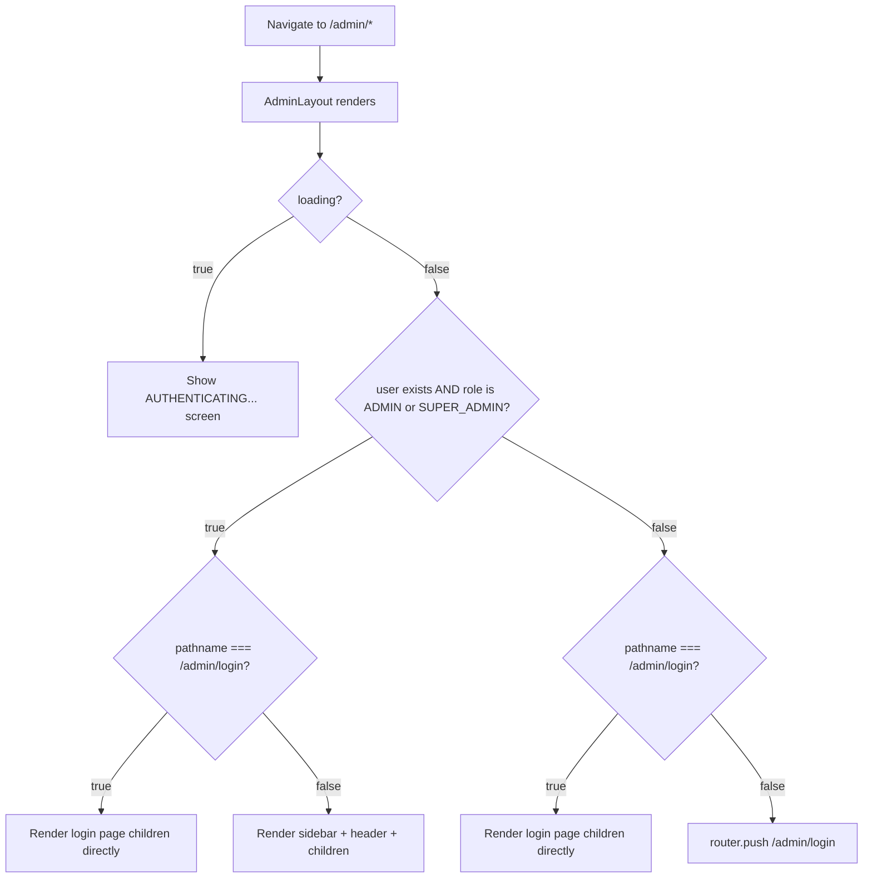
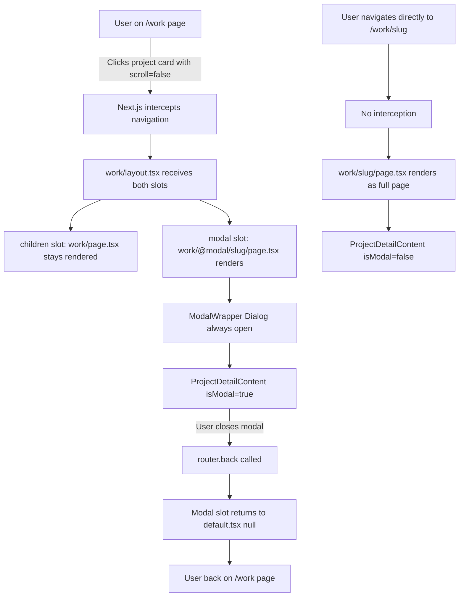

# Routes_Pages_Flow.md — Complete Routing and Page Structure

## Executive Summary

This document maps every route in the Next.js 15 App Router codebase, including route groups, parallel routes, intercepting routes, dynamic segments, layouts, and access control behavior.

The application has **35 distinct routes** across three surfaces: a public portfolio site, a public blog, and a private admin panel. The routing architecture uses four App Router features simultaneously: route groups (`(admin)`), parallel routes (`@modal`), intercepting routes (`(.)[slug]`), and nested dynamic segments (`[slug]`, `[id]`).

**Graphify confirms the routing communities:**
- Community 5 (cohesion 0.44): `BlogDetailPage`, `ProjectModalPage`, `ProjectPage`, `getProject`, `serialize` — the project detail dual-route pattern is the tightest public routing cluster
- Community 7 (cohesion 0.50): `WorkPage`, `getExperiments`, `getFlagships`, `getGlobalConfig`, `serialize` — the work archive pipeline
- Community 8 (cohesion 0.57): `BlogPage`, `getBlogData`, `getGlobalConfig`, `serialize` — the blog list pipeline
- Community 10 (cohesion 0.83): `checkAdminAccess`, `handleEmailLogin`, `handleGoogleLogin` — the auth flow is the tightest cluster in the entire codebase

**Key routing facts confirmed from source:**
- The blog post page (`/blog/[slug]`) now fetches `relatedPosts` and `relatedProjects` server-side, but `post-client.tsx` does not yet render them — they are fetched but unused
- `ProjectDetailContent` is now a Server Component (no `'use client'` directive in latest source)
- The `IntroScreen` is mounted in `layout.tsx` and uses `pathname === '/'` to only render on the home page
- All public pages use `export const dynamic = 'force-dynamic'` except `/work/[slug]` and `/blog/[slug]` which use `React.cache()` without `force-dynamic`

---

## Route Map

### Complete Route Tree

```
src/app/
├── layout.tsx                          ← Root layout (all routes)
├── page.tsx                            → /
├── robots.ts                           → /robots.txt
├── sitemap.ts                          → /sitemap.xml
│
├── blog/
│   ├── page.tsx                        → /blog
│   └── [slug]/
│       ├── page.tsx                    → /blog/[slug]
│       └── post-client.tsx             (Client Component, no route)
│
├── work/
│   ├── layout.tsx                      ← Work layout (parallel route host)
│   ├── page.tsx                        → /work
│   ├── work-client.tsx                 (Client Component, no route)
│   ├── default.tsx                     (Parallel route default — renders null)
│   ├── [slug]/
│   │   └── page.tsx                    → /work/[slug]  (full page)
│   └── @modal/
│       ├── default.tsx                 (Modal slot default — renders null)
│       └── (.)[slug]/
│           └── page.tsx                → /work/[slug]  (intercepting modal)
│
└── (admin)/                            ← Route group (no URL segment)
    └── admin/
        ├── layout.tsx                  ← Admin layout (auth guard + sidebar)
        ├── page.tsx                    → /admin
        ├── login/
        │   └── page.tsx                → /admin/login
        ├── hero/
        │   └── page.tsx                → /admin/hero
        ├── about/
        │   └── page.tsx                → /admin/about
        ├── projects/
        │   ├── page.tsx                → /admin/projects
        │   ├── new/
        │   │   └── page.tsx            → /admin/projects/new
        │   └── [id]/
        │       └── page.tsx            → /admin/projects/[id]
        ├── blog/
        │   ├── page.tsx                → /admin/blog
        │   ├── new/
        │   │   └── page.tsx            → /admin/blog/new
        │   └── [id]/
        │       └── page.tsx            → /admin/blog/[id]
        ├── experience/
        │   ├── page.tsx                → /admin/experience
        │   ├── new/
        │   │   └── page.tsx            → /admin/experience/new
        │   └── [id]/
        │       └── page.tsx            → /admin/experience/[id]
        ├── testimonials/
        │   ├── page.tsx                → /admin/testimonials
        │   ├── new/
        │   │   └── page.tsx            → /admin/testimonials/new
        │   └── [id]/
        │       └── page.tsx            → /admin/testimonials/[id]
        ├── contact/
        │   └── page.tsx                → /admin/contact
        ├── leads/
        │   └── page.tsx                → /admin/leads
        ├── seo/
        │   └── page.tsx                → /admin/seo
        ├── settings/
        │   └── page.tsx                → /admin/settings
        └── interface/
            └── page.tsx                → /admin/interface
```

### Route Summary Table

| Route | Type | Access | Layout | Caching | Firestore Collections |
|---|---|---|---|---|---|
| `/` | Static segment | Public | Root | force-dynamic | site_config/*, projects, experience, testimonials |
| `/blog` | Static segment | Public | Root | force-dynamic | blog, site_config/global, site_config/seo_pages |
| `/blog/[slug]` | Dynamic | Public | Root | React.cache() | blog, site_config/global |
| `/work` | Static segment | Public | Root + Work | force-dynamic | projects, site_config/global, site_config/seo_pages |
| `/work/[slug]` | Dynamic | Public | Root + Work | React.cache() | projects, site_config/global |
| `/work/[slug]` (modal) | Intercepting | Public | Root + Work | None | projects |
| `/robots.txt` | Special | Public | None | Static | None |
| `/sitemap.xml` | Special | Public | None | Dynamic | blog, projects |
| `/admin` | Static segment | ADMIN+ | Root + Admin | Client-side | projects, blog, contact_leads |
| `/admin/login` | Static segment | Public | Root + Admin (bypass) | Client-side | users |
| `/admin/hero` | Static segment | ADMIN+ | Root + Admin | Client-side | site_config/hero |
| `/admin/about` | Static segment | ADMIN+ | Root + Admin | Client-side | site_config/about |
| `/admin/projects` | Static segment | ADMIN+ | Root + Admin | Client-side | projects |
| `/admin/projects/new` | Static segment | ADMIN+ | Root + Admin | Client-side | projects |
| `/admin/projects/[id]` | Dynamic | ADMIN+ | Root + Admin | Client-side | projects |
| `/admin/blog` | Static segment | ADMIN+ | Root + Admin | Client-side | blog |
| `/admin/blog/new` | Static segment | ADMIN+ | Root + Admin | Client-side | blog |
| `/admin/blog/[id]` | Dynamic | ADMIN+ | Root + Admin | Client-side | blog |
| `/admin/experience` | Static segment | ADMIN+ | Root + Admin | Client-side | experience |
| `/admin/experience/new` | Static segment | ADMIN+ | Root + Admin | Client-side | experience |
| `/admin/experience/[id]` | Dynamic | ADMIN+ | Root + Admin | Client-side | experience |
| `/admin/testimonials` | Static segment | ADMIN+ | Root + Admin | Client-side | testimonials |
| `/admin/testimonials/new` | Static segment | ADMIN+ | Root + Admin | Client-side | testimonials |
| `/admin/testimonials/[id]` | Dynamic | ADMIN+ | Root + Admin | Client-side | testimonials |
| `/admin/contact` | Static segment | ADMIN+ | Root + Admin | Client-side | site_config/contact |
| `/admin/leads` | Static segment | ADMIN+ | Root + Admin | Client-side | contact_leads |
| `/admin/seo` | Static segment | ADMIN+ | Root + Admin | Client-side | site_config/seo_pages, site_config/global |
| `/admin/settings` | Static segment | ADMIN+ | Root + Admin | Client-side | site_config/global |
| `/admin/interface` | Static segment | ADMIN+ | Root + Admin | Client-side | site_config/navbar, site_config/footer |

---

## Public Route Flow

### `/` — Home Page

**File:** `src/app/page.tsx`
**Type:** Server Component
**Caching:** `export const dynamic = 'force-dynamic'`
**Layout:** Root layout (Hero3D background, IntroScreen, CustomCursor)

**Data fetched server-side (all via `React.cache()`):**
- `getGlobalConfig()` → `site_config/global`
- `getSeoPageConfig()` → `site_config/seo_pages`
- `getHeroData()` → `site_config/hero`
- `getNavbarData()` → `site_config/navbar`
- `getFooterData()` → `site_config/footer`
- `getAboutData()` → `site_config/about`
- `getContactData()` → `site_config/contact`
- `getProjects(3)` → `projects` (FLAGSHIP, published, top 3 by order)
- `getExperience()` → `experience` (ordered by `order` field)
- `getTestimonials()` → `testimonials`

**Sections rendered:** IntroScreen (overlay), Navbar, ScrollIndicator, Hero, About, Projects (3), Experience (conditional), Testimonials (conditional), Contact, Footer

**Conditional rendering:**
- Experience section: only if `config.visibility.showExperience !== false`
- Testimonials section: only if `config.visibility.showTestimonials !== false`

**Entry points:** Direct URL, any internal link to `/`, logo click from any page

**Exit points:** Navbar links to `/work`, `/blog`, `/#about`, `/#experience`, `/#contact`; Hero CTAs scroll to `#contact` and `#work`; Footer links to `/work`, `/blog`; Project cards link to `/work/[slug]`

---

### `/work` — Work Archive

**File:** `src/app/work/page.tsx` → `src/app/work/work-client.tsx`
**Type:** Server Component → Client Component
**Caching:** `export const dynamic = 'force-dynamic'`
**Layout:** Root layout + Work layout (parallel route host)

**Data fetched server-side:**
- `getGlobalConfig()` → `site_config/global`
- `getSeoPageConfig()` → `site_config/seo_pages`
- `getPublishedProjects()` → `projects` (all published, sorted by order)
- `getExperiments()` → filters EXPERIMENT type from above
- `getFlagships()` → filters FLAGSHIP type from above

**Note:** `getPublishedProjects()` is called once via `React.cache()` and the results are filtered in `getExperiments()` and `getFlagships()` — no duplicate Firestore reads.

**Sections rendered:** Navbar, Hero headline, Flagship Builds (Projects component), Experiments grid (conditional on `config.visibility.showExperiments`), Footer

**Entry points:** Navbar "Works" link, Footer "View Full Portfolio", Hero "Explore Work" CTA, Projects "View All Creations" button

**Exit points:** Project cards link to `/work/[slug]` with `scroll={false}` (triggers modal); Navbar links; Footer links

---

### `/work/[slug]` — Project Detail (Full Page)

**File:** `src/app/work/[slug]/page.tsx`
**Type:** Server Component
**Caching:** `React.cache()` (no `force-dynamic`)
**Layout:** Root layout + Work layout

**Data fetched:**
- `getProject(slug)` → `projects` (slug-first, ID fallback)
- `getGlobalConfig()` → `site_config/global`

**Slug resolution:** Tries `where('slug', '==', slug)` first; falls back to `getDoc(doc(db, 'projects', slug))` using the slug as a document ID.

**Rendered when:** Direct URL access to `/work/[slug]` (not navigated from `/work` list)

**Sections rendered:** Navbar, Breadcrumbs (`Home > Work > [title]`), ProjectDetailContent (isModal=false), Footer

**404 behavior:** If project not found, renders "Project not found" heading with no navigation

**Entry points:** Direct URL, sitemap links, search engine results

**Exit points:** Breadcrumb "Work" link → `/work`; Footer links; Navbar links

---

### `/work/[slug]` — Project Detail (Modal — Intercepting Route)

**File:** `src/app/work/@modal/(.)[slug]/page.tsx`
**Type:** Server Component (intercepting route)
**Caching:** No `force-dynamic`, no `React.cache()`
**Layout:** Root layout + Work layout (modal slot)

**Trigger condition:** Navigation to `/work/[slug]` from within the `/work` page using `<Link scroll={false}>`. The `(.)[slug]` syntax intercepts the navigation and renders in the `@modal` parallel slot instead of the `[slug]` full page.

**Data fetched:** Same `getProject(slug)` function (inline, not cached)

**Rendered when:** User clicks a project card on `/work` or `/` (home page projects section)

**Sections rendered:** `ModalWrapper` (Radix Dialog, always open) → `ProjectDetailContent` (isModal=true, max-h-[90vh])

**Close behavior:** `onOpenChange={(open) => !open && router.back()}` — closing the modal calls `router.back()`, returning to the work list

**Default files:**
- `src/app/work/default.tsx` → returns `null` (children slot default when no page matches)
- `src/app/work/@modal/default.tsx` → returns `null` (modal slot default when no modal is active)

**The critical contract:** `scroll={false}` on project `<Link>` components is what triggers interception. Without it, Next.js performs a full navigation to `/work/[slug]` and the modal is bypassed.

---

### `/blog` — Blog List

**File:** `src/app/blog/page.tsx`
**Type:** Server Component
**Caching:** `export const dynamic = 'force-dynamic'`
**Layout:** Root layout

**Data fetched:**
- `getBlogData()` → `blog` (published, sorted by `createdAt` descending)
- `getGlobalConfig()` → `site_config/global`
- `getSeoPageConfig()` → `site_config/seo_pages`

**Sections rendered:** Navbar, Blog header (H1 "The Journal."), BlogListClient (posts), Contact, Footer

**Entry points:** Navbar "Journal" link, Footer "Visit the Journal", Breadcrumb from blog post

**Exit points:** Post cards link to `/blog/[slug]`; Contact section; Footer links; Navbar links

---

### `/blog/[slug]` — Blog Post

**File:** `src/app/blog/[slug]/page.tsx` → `src/app/blog/[slug]/post-client.tsx`
**Type:** Server Component → Client Component
**Caching:** `React.cache()` (no `force-dynamic`)
**Layout:** Root layout

**Data fetched server-side:**
- `getPost(slug)` → `blog` (slug-first, ID fallback)
- `getGlobalConfig()` → `site_config/global`
- `getRelatedPosts(post.id, categories)` → `blog` (up to 10 published, scored by category overlap, top 3)
- `getRelatedProjects(categories)` → `projects` (up to 20 published, scored by tech/category overlap, top 3)

**Important:** `relatedPosts` and `relatedProjects` are fetched server-side and passed to `PostClient` as props, but `PostClient` does not currently render them. They are fetched but unused in the current `post-client.tsx`.

**Slug resolution:** Same pattern as project — slug field first, document ID fallback.

**Sections rendered:** Navbar, reading progress bar (fixed h-1 bg-primary), article header (breadcrumbs, categories, H1, date), hero image (21:9), prose content, post footer (back link, share/bookmark stubs), sidebar (abstract, author, subscribe stub), Footer, BlogPosting JSON-LD

**404 behavior:** If post not found, renders "Post not found" with "Back to Journal" link

**Entry points:** Blog list cards, direct URL, sitemap links

**Exit points:** "Back to Journal" → `/blog`; Breadcrumb "Journal" → `/blog`; Footer links; Navbar links

---

## Admin Route Flow

### Auth Guard Behavior

The admin layout (`src/app/(admin)/admin/layout.tsx`) implements client-side auth protection:



**Gap:** This is client-side only. The server renders the admin HTML before the auth check fires. There is no `middleware.ts`.

### `/admin/login` — Login Page

**File:** `src/app/(admin)/admin/login/page.tsx`
**Type:** Client Component
**Access:** Public (bypasses auth guard)
**Layout:** Root layout + Admin layout (login bypass — renders children directly)

**Auth methods:**
1. Email + password via `signInWithEmailAndPassword`
2. Google OAuth via `signInWithPopup`

**Post-login flow:**
1. Firebase Auth signs in
2. `checkAdminAccess(user)` reads `users/{uid}` from Firestore
3. If document exists: checks `role` for `ADMIN` or `SUPER_ADMIN`
4. If no document AND email matches `OWNER_EMAIL`: creates `SUPER_ADMIN` document (bootstrapping)
5. If access granted: `router.push('/admin')`
6. If access denied: `auth.signOut()` + destructive toast

**Entry points:** Direct URL, redirect from any protected admin route

**Exit points:** On success → `/admin`; On failure → stays on `/admin/login`

---

### `/admin` — Dashboard

**File:** `src/app/(admin)/admin/page.tsx`
**Type:** Client Component
**Access:** ADMIN or SUPER_ADMIN

**Data fetched client-side:**
- `getDocs(collection(db, 'projects'))` — total count
- `getDocs(collection(db, 'blog'))` — total count
- `getDocs(collection(db, 'contact_leads'))` — total count
- `getDocs(query(collection(db, 'contact_leads'), where('status', '==', 'new')))` — new leads count

**Note:** Dashboard analytics chart uses hardcoded mock data. Activity log shows static entries.

---

### `/admin/hero`, `/admin/about`, `/admin/contact` — Section Config Editors

**Type:** Client Component (all three)
**Access:** ADMIN or SUPER_ADMIN
**Pattern:** Load from `site_config/{section}` on mount → edit in local state → `setDoc` on save

---

### `/admin/projects`, `/admin/blog`, `/admin/experience`, `/admin/testimonials` — CRUD List Pages

**Type:** Client Component (all)
**Access:** ADMIN or SUPER_ADMIN
**Pattern:** Load collection on mount → search/filter client-side → per-item edit/delete/status toggle → bulk actions via floating bar

**Sub-routes:**
- `/new` — create form (uses `?clone=[id]` query param for cloning)
- `/[id]` — edit form (loads existing document by ID)

---

### `/admin/leads` — Contact Leads Inbox

**Type:** Client Component
**Access:** ADMIN or SUPER_ADMIN
**Data:** `contact_leads` collection, ordered by `createdAt` descending
**Actions:** Toggle read/unread status, delete

---

### `/admin/seo` — SEO Command Panel

**Type:** Client Component
**Access:** ADMIN or SUPER_ADMIN
**Data:** `site_config/seo_pages` (work/blog overrides) + `site_config/global.seo` (defaults)
**Tabs:** Home, Work, Journal

---

### `/admin/settings` — Global Settings

**Type:** Client Component
**Access:** ADMIN or SUPER_ADMIN
**Data:** `site_config/global` (identity, socials, resume, visibility, seo)
**Tabs:** Identity (GEO), Authority, Social Bridge, Assets (S3), Interface

---

### `/admin/interface` — Layout Config

**Type:** Client Component
**Access:** ADMIN or SUPER_ADMIN
**Data:** `site_config/navbar` + `site_config/footer`
**Features:** Drag-to-reorder nav items and footer links via Framer Motion `Reorder`

---

## Dynamic and Modal Route Behavior

### The Parallel Route Modal Pattern

This is the most architecturally complex routing feature in the codebase. It requires understanding four files working together:



**The four required files:**
1. `src/app/work/layout.tsx` — declares `children` and `modal` slots
2. `src/app/work/default.tsx` — returns `null` (prevents children slot error when no page matches)
3. `src/app/work/@modal/default.tsx` — returns `null` (modal slot is empty by default)
4. `src/app/work/@modal/(.)[slug]/page.tsx` — the intercepting route

**The `(.)[slug]` syntax:** The `(.)` prefix means "intercept from the same level" — it intercepts `/work/[slug]` when navigated from within the `/work` route segment.

**The `scroll={false}` contract:** Project card links use `<Link href="/work/[slug]" scroll={false}>`. This is what triggers the interception. Without `scroll={false}`, Next.js performs a full navigation and the modal is bypassed.

### Dynamic Segment Resolution

Both `/blog/[slug]` and `/work/[slug]` use a two-step slug resolution:

```typescript
// Step 1: Try by slug field
const q = query(collection(db, 'projects'), where('slug', '==', slug), limit(1));
const snap = await getDocs(q);
if (!snap.empty) return serialize({ id: snap.docs[0].id, ...snap.docs[0].data() });

// Step 2: Fallback to document ID
const docSnap = await getDoc(doc(db, 'projects', slug));
if (docSnap.exists()) return serialize({ id: docSnap.id, ...docSnap.data() });
```

**Implication:** Both `/work/abc-slug` and `/work/firestoreDocId` are valid URLs for the same project. The canonical URL is set to the slug-based URL, but both remain accessible — a potential duplicate content issue.

### Admin Dynamic Routes (`[id]`)

Admin edit pages use `useParams()` to get the document ID:
```typescript
const { id } = useParams();
// Then: getDoc(doc(db, 'projects', id as string))
```

Admin `[id]` routes use the Firestore document ID directly (not a slug). This is different from the public routes which use a `slug` field.

---

## Navigation Relationships

### Public Navigation Graph

```mermaid
graph TD
    HOME[/ Home] -->|Navbar Works| WORK[/work]
    HOME -->|Navbar Journal| BLOG[/blog]
    HOME -->|Project card scroll=false| MODAL[/work/slug Modal]
    HOME -->|Footer Visit Journal| BLOG
    HOME -->|Footer View Portfolio| WORK

    WORK -->|Project card scroll=false| MODAL
    WORK -->|Project card direct| PROJ[/work/slug Full Page]
    MODAL -->|router.back| WORK
    PROJ -->|Breadcrumb Work| WORK
    PROJ -->|Navbar| HOME
    PROJ -->|Navbar| BLOG

    BLOG -->|Post card| POST[/blog/slug]
    POST -->|Back to Journal| BLOG
    POST -->|Breadcrumb Journal| BLOG
    POST -->|Navbar| HOME
    POST -->|Navbar| WORK
    POST -->|Footer| HOME
```

### Admin Navigation Graph

```mermaid
graph TD
    LOGIN[/admin/login] -->|Success| DASH[/admin]
    DASH -->|Sidebar| HERO[/admin/hero]
    DASH -->|Sidebar| ABOUT[/admin/about]
    DASH -->|Sidebar| PROJ[/admin/projects]
    DASH -->|Sidebar| BLOG[/admin/blog]
    DASH -->|Sidebar| EXP[/admin/experience]
    DASH -->|Sidebar| TEST[/admin/testimonials]
    DASH -->|Sidebar| CONT[/admin/contact]
    DASH -->|Sidebar| LEADS[/admin/leads]
    DASH -->|Sidebar| SEO[/admin/seo]
    DASH -->|Sidebar| SET[/admin/settings]
    DASH -->|Sidebar| INT[/admin/interface]

    PROJ -->|New Build button| PROJNEW[/admin/projects/new]
    PROJ -->|Edit icon| PROJEDIT[/admin/projects/id]
    PROJNEW -->|Save / Back| PROJ
    PROJEDIT -->|Save / Back| PROJ

    BLOG -->|Draft New Entry| BLOGNEW[/admin/blog/new]
    BLOG -->|Edit Entry| BLOGEDIT[/admin/blog/id]
    BLOGNEW -->|Save / Back| BLOG
    BLOGEDIT -->|Save / Back| BLOG

    EXP -->|Record Milestone| EXPNEW[/admin/experience/new]
    EXP -->|Edit| EXPEDIT[/admin/experience/id]
    TEST -->|Add New Voice| TESTNEW[/admin/testimonials/new]
    TEST -->|Edit| TESTEDIT[/admin/testimonials/id]

    DASH -->|Terminate Session| HOME[/]
```

### Cross-Surface Navigation

| From | To | Mechanism |
|---|---|---|
| Any public page | `/admin/login` | Direct URL only (no public link to admin) |
| `/admin` (sign out) | `/` | `router.push('/')` after `signOut()` |
| Admin sidebar logo | `/admin` | `<Link href="/admin">` |
| No public page | Any `/admin/*` | No public links exist to admin routes |

---

## Key Takeaways

1. **The parallel route modal pattern is the most sophisticated routing feature.** Four files must work together: the layout declaring both slots, two `default.tsx` null renders, and the intercepting route. The `scroll={false}` link contract is the critical trigger — removing it silently breaks the modal and falls back to full-page navigation.

2. **`/work/[slug]` has two rendering paths for the same URL.** When navigated from `/work` with `scroll={false}`, it renders as a modal overlay. When accessed directly, it renders as a full page. Both paths use the same `ProjectDetailContent` component with an `isModal` prop.

3. **Admin route protection is client-side only.** The `useEffect` in `AdminLayoutContent` fires after the server has already rendered the HTML. There is no `middleware.ts`. Any unauthenticated user who navigates directly to `/admin/projects` will briefly see the admin shell before being redirected.

4. **The blog post page fetches related posts and projects server-side but does not render them.** `src/app/blog/[slug]/page.tsx` calls `getRelatedPosts()` and `getRelatedProjects()` and passes them to `PostClient`, but `post-client.tsx` does not use these props. This is a half-implemented feature — the data pipeline exists but the UI is missing.

5. **`/blog/[slug]` and `/work/[slug]` both have duplicate URL risk.** Both routes accept either the `slug` field value or the Firestore document ID as the URL parameter. Both URLs resolve to the same content. Canonical URLs mitigate this for crawlers but both remain accessible.

6. **The `(admin)` route group is purely organizational.** It does not add a URL segment. `/admin/login` is the URL, not `/(admin)/admin/login`. The group exists only to apply the admin layout to all routes under `admin/`.

7. **The root layout applies globally to all routes including admin.** `Hero3D`, `IntroScreen`, and `CustomCursor` are mounted in `src/app/layout.tsx`. `IntroScreen` uses `pathname === '/'` to only render on the home page. `Hero3D` runs on all pages including admin. `CustomCursor` runs on all pages.

8. **`/work` and `/blog` use `force-dynamic` but `/work/[slug]` and `/blog/[slug]` do not.** The list pages opt out of all caching. The detail pages use `React.cache()` for deduplication within a request but have no explicit caching directive — they will use Next.js default behavior (which may or may not cache depending on the deployment environment).

9. **The admin `[id]` routes use Firestore document IDs, not slugs.** This is different from the public `[slug]` routes. Admin URLs like `/admin/projects/abc123` use the raw Firestore document ID. Public URLs like `/work/my-project-slug` use the `slug` field.

10. **Maximum crawl depth from home is 2 clicks.** Every content page (blog post, project detail) is reachable within 2 clicks from the home page. The sitemap includes all published posts and projects. This is good for SEO crawlability.

---

*Document generated from direct source code inspection of all 35 route files, cross-referenced with Graphify dependency graph (252 nodes, 245 edges, 11 communities). Key routing communities: Community 5 (project detail, cohesion 0.44), Community 7 (work archive, cohesion 0.50), Community 8 (blog pipeline, cohesion 0.57), Community 10 (auth flow, cohesion 0.83).*
