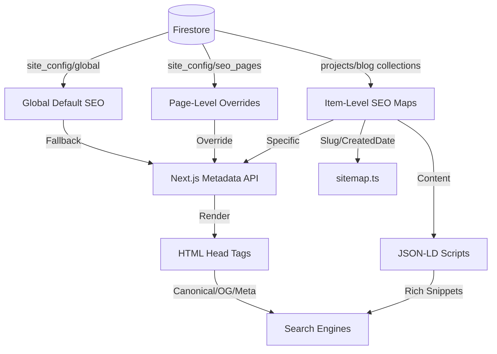

# SEO Surface Inventory Audit: Kartik Jindal Cinematic Portfolio

## 1. Executive Summary
The application utilizes the **Next.js 15 App Router Metadata API** in coordination with **Cloud Firestore** to deliver a dynamic, CMS-controlled SEO framework. The architecture employs a "Cascade with Override" strategy, where metadata (Titles, Descriptions, OG Images, Canonical URLs, and Indexability) is managed at Global, Page, and Item levels. Technical SEO is supported by automated sitemap generation, bot exclusion rules for administrative routes, and JSON-LD structured data for rich snippets.

---

## 2. Complete SEO-Relevant File Inventory

### Core SEO Controllers (Direct)
These files explicitly define how search engines crawl and interpret the site.

| Exact Path | Why it matters for SEO | Type | Scope | Modifiability |
|:---|:---|:---|:---|:---|
| `src/app/layout.tsx` | Defines the root metadata template and fallback attributes. | Direct | Global | Hardcoded Base |
| `src/app/sitemap.ts` | Generates `sitemap.xml` by crawling Firestore blog slugs. | Direct | Global | Dynamic (DB Logic) |
| `src/app/robots.ts` | Controls bot access; prevents indexing of `/admin` route group. | Direct | Global | Hardcoded |
| `src/app/page.tsx` | Orchestrates metadata for the home route via `site_config/seo_pages`. | Direct | Route | CMS-Controlled |
| `src/app/work/page.tsx` | Orchestrates metadata for the portfolio archive via `seo_pages`. | Direct | Route | CMS-Controlled |
| `src/app/blog/[slug]/page.tsx` | Orchestrates dynamic item metadata and canonical overrides. | Direct | Route | CMS-Controlled |

### Structured Data & UI Indicators (Direct/Indirect)
Files that contribute to rich snippets or influence internal linking and discovery.

| Exact Path | Why it matters for SEO | Type | Scope | Modifiability |
|:---|:---|:---|:---|:---|
| `src/app/blog/[slug]/post-client.tsx` | Injects JSON-LD for `BlogPosting` Schema.org support. | Direct | Item | Logic-Based |
| `src/components/portfolio/breadcrumbs.tsx` | Informs search engine navigation path and internal hierarchy. | Indirect | Shared | Logic-Based |
| `src/components/portfolio/navbar.tsx` | Controls primary discovery links and internal anchor text. | Indirect | Global | CMS-Controlled |
| `src/components/portfolio/footer.tsx` | Manages external social signals and secondary internal links. | Indirect | Global | CMS-Controlled |

### Admin SEO Command Center (Direct - Control Plane)
The administrative interface used to define and tune SEO data.

| Exact Path | Why it matters for SEO | Type | Scope | Modifiability |
|:---|:---|:---|:---|:---|
| `src/app/(admin)/admin/seo/page.tsx` | Central UI for modifying page-level SEO overrides. | Direct | Admin | Management UI |
| `src/app/(admin)/admin/blog/[id]/page.tsx` | Interface for editing specific post metadata maps. | Direct | Admin | Management UI |
| `src/app/(admin)/admin/projects/[id]/page.tsx` | Interface for editing specific project metadata maps. | Direct | Admin | Management UI |
| `src/components/admin/seo-hud.tsx` | Provides scoring logic that guides SEO content quality. | Indirect | Admin | Logic-Based |

### Configuration & Rendering Strategy (Indirect)
Configurations affecting crawl behavior, site speed, and rendering signals.

| Exact Path | Why it matters for SEO | Type | Scope | Modifiability |
|:---|:---|:---|:---|:---|
| `src/lib/firebase/config.ts` | Connection hub for all dynamic SEO metadata storage. | Indirect | Global | Configuration |
| `next.config.ts` | Image remote patterns; affects Largest Contentful Paint (LCP). | Indirect | Global | Configuration |
| `src/app/globals.css` | Affects layout stability (CLS) and hierarchy signals. | Indirect | Global | Hardcoded |

---

## 3. Dependency Map: SEO Data Flow

---

## 4. Potentially SEO-Relevant But Not Yet Verified

- **`src/app/blog/page.tsx`**: Currently marked with `'use client'`. This prevents the export of `generateMetadata`, potentially leaving the Journal index with only root fallbacks.
- **`src/components/portfolio/intro-screen.tsx`**: As a full-screen animation overlay, it may impact LCP and Cumulative Layout Shift (CLS) if not excluded from bot rendering.
- **`src/components/portfolio/hero-3d.tsx`**: The Three.js environment's impact on main-thread blocking could indirectly affect ranking via Core Web Vitals.
- **Environment Variables**: `NEXT_PUBLIC_BASE_URL` is critical for `sitemap.ts` and canonicalization. If missing or misconfigured, it results in broken internal linking schemas.
- **`src/app/work/work-client.tsx`**: Projects are currently rendered in client-side Modals (`Dialog`). This likely means search engines cannot index individual project metadata despite fields being present in the CMS.
